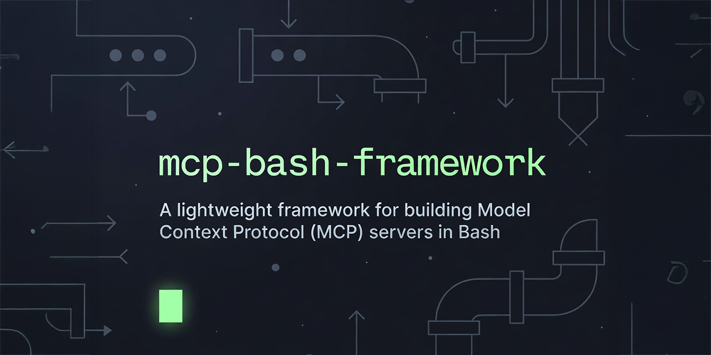
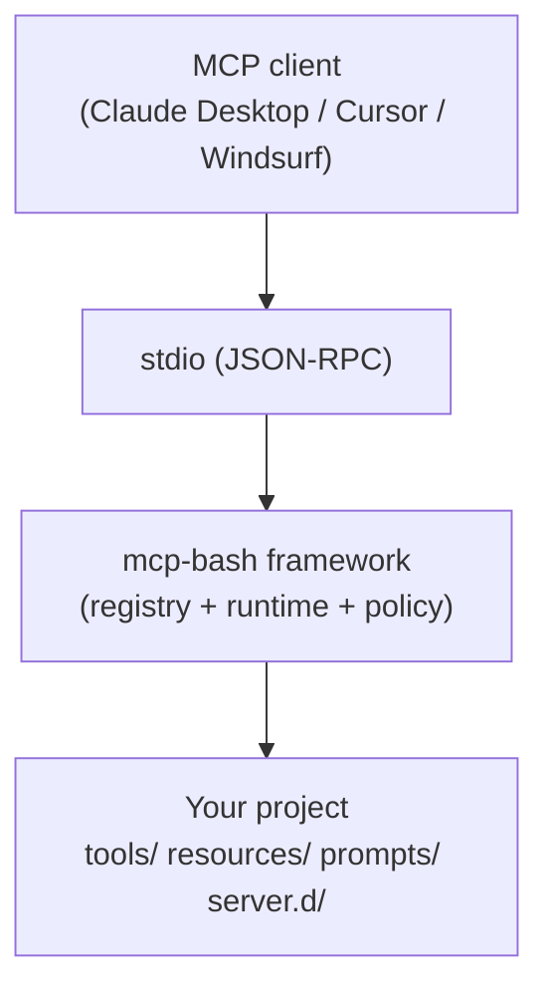

<!--
NOTE: README.md is generated from README.md.in.
Edit README.md.in and run: bash scripts/render-readme.sh
-->

# mcp-bash

[](assets/mcp-bash-framework.png)

[](https://github.com/yaniv-golan/mcp-bash-framework/actions)
[](LICENSE)
[](https://www.gnu.org/software/bash/)
[](https://spec.modelcontextprotocol.io/)
[](#runtime-requirements)

> **Repository:** [`mcp-bash-framework`](https://github.com/yaniv-golan/mcp-bash-framework) &nbsp;•&nbsp; **CLI/Binary:** `mcp-bash`

## Contents

- [MCP Spec Coverage](#mcp-spec-coverage)
- [Why Bash?](#why-bash)
- [Quick Start](#quick-start)
- [Configure Your MCP Client](#configure-your-mcp-client)
- [MCPB Bundles](#mcpb-bundles)
- [Project Structure](#project-structure)
- [Configuration](#configuration)
- [Learn by Example](#learn-by-example)
- [Documentation](#documentation)
- [Built with mcp-bash](#built-with-mcp-bash)
- [FAQ](#faq)

> **The most complete MCP implementation in pure Bash.** Tools, resources, prompts, elicitation, roots, progress, cancellation—the full spec, no runtimes beyond your shell.
>
> - Runs on Bash 3.2+ (macOS/Linux stock). No Node, no Python, no containers.
> - Handles concurrency, timeouts, and cancellation the way production systems need.
> - You write the tools. The framework stays out of your way.

## TL;DR

**Turn any Bash script into an MCP tool in minutes.** No Node, no Python, no containers.

```bash
mcp-bash new my-server && cd my-server
mcp-bash scaffold tool my-tool   # edit tools/my-tool/tool.sh
mcp-bash config --client cursor  # paste into your MCP client
mcp-bash bundle                  # create distributable package
```

## What you’ll build



## Design Principles

- Tools shouldn’t need another runtime to talk to AI.
- Everything must be inspectable. No magic.
- If it’s not needed in production, it isn’t in the framework.
- Your project stays yours. The framework upgrades cleanly.

## MCP Spec Coverage

mcp-bash targets the **2025-11-25** MCP specification with negotiated downgrades to older versions.

| Category | Coverage | Notes |
|----------|----------|-------|
| Core Protocol | ✅ Full | Lifecycle, ping, capabilities, downgrades |
| Tools | ✅ Full | list, call, icons, errors, listChanged, annotations |
| Resources | ✅ Full | list, read, subscriptions, templates, binary |
| Prompts | ✅ Full | list, get, arguments, icons |
| Utilities | ✅ Full | Progress, cancellation, logging, completion |
| Elicitation | ✅ Full | Form, URL, enum, multi-choice modes |
| Roots | ✅ Full | Server→client request, listChanged |

**Not yet implemented:** Audio content, sampling. Tasks (async job/poll) and server-identity discovery are HTTP-oriented and not applicable to stdio.

Transport is stdio-only by design. See [Remote Connectivity](docs/REMOTE.md) for HTTP/SSE proxy options, including the shared-secret guard (`MCPBASH_REMOTE_TOKEN`) and readiness probe (`mcp-bash --health`).

→ [Full compliance matrix](SPEC-COMPLIANCE.md)

For a complete feature-by-feature breakdown across all MCP versions, see the [Feature Support Matrix](SPEC-COMPLIANCE.md#feature-support-matrix) in `SPEC-COMPLIANCE.md`.

## Why Bash?

| | mcp-bash | TypeScript SDK | Python SDK |
|---|----------|----------------|------------|
| Runtime | Bash 3.2+ (pre-installed) | Node.js 18+ | Python 3.10+ |
| Install | `curl \| bash` or `git clone` | `npm install` | `pip install` |
| Startup | No VM warmup | Node.js startup | Python startup |
| Dependencies | jq or gojq | npm packages | pip packages |
| Best for | Shell automation, existing scripts, air-gapped/minimal environments | Node.js applications | Python applications |

If your tools are already shell scripts, wrapping them in Node or Python adds complexity for no benefit. mcp-bash lets you expose them directly.

## Quick Start

When you run `mcp-bash` from inside a project (a directory containing `server.d/server.meta.json`), it auto-detects the project root. Running `mcp-bash` outside any project starts a temporary getting-started helper tool. For MCP clients, set `MCPBASH_PROJECT_ROOT` so the server can find your project regardless of working directory.

### 0. Requirements (10 seconds)

```bash
# Preflight: Bash 3.2+ and jq/gojq for full functionality (tools/resources/prompts).
bash --version | head -1
command -v jq >/dev/null 2>&1 || command -v gojq >/dev/null 2>&1 || printf '%s\n' '⚠ jq/gojq missing: minimal mode only (tools/resources/prompts disabled)'
```

### 1. Install the Framework

Quick install (good for local dev / trusted networks):

```bash
curl -fsSL "https://raw.githubusercontent.com/yaniv-golan/mcp-bash-framework/v0.10.0/install.sh" | bash -s -- --yes --version "v0.10.0"
```

Verified install (recommended for production / security-sensitive environments):

```bash
version="v0.10.0"
file="mcp-bash-${version}.tar.gz"
curl -fsSLO "https://github.com/yaniv-golan/mcp-bash-framework/releases/download/${version}/${file}"
curl -fsSLO "https://github.com/yaniv-golan/mcp-bash-framework/releases/download/${version}/SHA256SUMS"

# Verify (macOS):
grep -E "([[:space:]]|\\*)${file}$" SHA256SUMS | shasum -a 256 -c -
# Verify (Linux):
grep -E "([[:space:]]|\\*)${file}$" SHA256SUMS | sha256sum -c -

curl -fsSLO "https://raw.githubusercontent.com/yaniv-golan/mcp-bash-framework/${version}/install.sh"
bash install.sh --archive "${file}" --version "${version}"
```

Why this is “verified”: you download the release tarball + `SHA256SUMS`, verify the checksum locally, then run the installer against the verified archive.

For tagged releases (`vX.Y.Z`), the installer also attempts to verify the archive against `SHA256SUMS` automatically when it’s available.

Manual/offline install (for policy-driven or air-gapped environments):

```bash
git clone https://github.com/yaniv-golan/mcp-bash-framework.git ~/.local/share/mcp-bash
mkdir -p ~/.local/bin && ln -sf ~/.local/share/mcp-bash/bin/mcp-bash ~/.local/bin/mcp-bash
echo 'export PATH="$HOME/.local/bin:$PATH"' >> ~/.bashrc  # or ~/.zshrc (if not already in PATH)
```

Pin a release with the installer (auto-prefixes `v` for bare versions):

```bash
bash install.sh --verify <sha256-from-SHA256SUMS> --version 0.10.0
```

### 1.5 Verify It Works (30 seconds)

Security defaults: hooks are disabled unless `MCPBASH_ALLOW_PROJECT_HOOKS=true`, and tools require an explicit allowlist (`MCPBASH_TOOL_ALLOWLIST=*` to allow all in trusted projects).

```bash
mcp-bash doctor
# Expected output includes lines like:
#   ✓ Bash version: 5.x.x (>= 3.2 required)
#   ✓ jq installed: /usr/bin/jq
#   All checks passed! Ready to build MCP servers.

# Preview and apply managed-install repairs (shim + optional upgrade when --min-version is set):
mcp-bash doctor --dry-run
mcp-bash doctor --fix

# Quick end-to-end test (optional):
mcp-bash new demo-server
cd demo-server
mcp-bash run-tool hello --allow-self --args '{"name":"World"}'
# Expected output includes: "Hello, World!"

# Cleanup (the demo-server directory persists until you remove it):
cd .. && rm -rf demo-server
```

<details>
<summary><strong>Something not working?</strong> (click to expand)</summary>

| Symptom | Likely cause | Fix |
|---------|--------------|-----|
| `mcp-bash: command not found` | PATH not configured | `export PATH="$HOME/.local/bin:$PATH"` then open a new shell |
| “Operating in minimal mode…” / tools missing | `jq`/`gojq` missing | `brew install jq` or `apt install jq` |
| “blocked by policy” | Default-deny tool policy | CLI: re-run with `--allow-self`. MCP clients: set `MCPBASH_TOOL_ALLOWLIST` in client config |
| Claude Desktop starts but shows no tools | GUI non-login env / PATH | Use `mcp-bash config --wrapper-env` and point the client at the wrapper |
| macOS `Operation not permitted` / quarantine | Gatekeeper quarantine | `scripts/macos-dequarantine.sh ~/.local/share/mcp-bash` (trusted paths only), restart client |
| Windows Git Bash path weirdness | MSYS path conversion | `MSYS2_ARG_CONV_EXCL="*"` (and prefer `jq` on Windows CI) |

Still stuck? Run `mcp-bash doctor` (or `mcp-bash doctor --json`) and include output when opening an issue.

</details>

### 2. Create Your Project

Your server code lives in a separate project directory:

```bash
mcp-bash new my-mcp-server
cd my-mcp-server
```

Already in a directory you created yourself? Run `mcp-bash init --name my-mcp-server [--no-hello]` instead.

### 3. Scaffold Your First Tool

```bash
mcp-bash scaffold tool check-disk
```

This scaffolds `tools/check-disk/tool.sh` and `tools/check-disk/tool.meta.json` in your project. You write the logic.
Each scaffolded tool also includes `tools/check-disk/smoke.sh`—run it after edits to ensure your tool’s stdout is valid JSON (update the sample args in the script if you change `tool.meta.json`).

### 3.5 (Optional) Add a Test Harness

Create a lightweight runner for tool smoke tests:

```bash
mcp-bash scaffold test
./test/run.sh --verbose  # add run_test calls inside test/run.sh
```

The harness wraps `mcp-bash run-tool`, validates your project before running, and refuses to overwrite existing `test/run.sh` or `test/README.md`.

## Configure Your MCP Client

Every client works the same way: point it at the framework and tell it where your project lives:

1. Set `MCPBASH_PROJECT_ROOT=/path/to/your/project`.
2. Point it at the `mcp-bash` binary (installed to `~/.local/bin/mcp-bash` by the installer).
   - If you generated a wrapper via `mcp-bash config --wrapper` or `--wrapper-env`, you can point clients at `<project-root>/<server-name>.sh`; the wrapper already wires `MCPBASH_PROJECT_ROOT` for you.

### Generate Config (CLI)

```bash
mcp-bash config --show
mcp-bash config --json           # machine-readable descriptor (name/command/env)
mcp-bash config --client cursor  # client-specific snippet
mcp-bash config --inspector      # ready-to-run Inspector command (stdio)
mcp-bash config --wrapper-env    # wrapper that sources your shell profile first (macOS-safe)
mcp-bash config --wrapper        # TTY: creates ./<server-name>.sh; piped/redirected: stdout
```

`config --show` prints one labeled snippet per supported client (headings like `# Claude Desktop`, `# Cursor`, etc.) so you can see which block to copy; use `--client <name>` or `--json` when you only want a single paste-ready block.

Copy the snippet for your client (Claude Desktop/CLI/Code, Cursor, Windsurf, LibreChat, etc.) and paste it into the appropriate config file. This sets `MCPBASH_PROJECT_ROOT` and the `mcp-bash` command path for you. When run in a terminal (stdout is a TTY), `config --wrapper` writes `<project-root>/<server-name>.sh`, marks it executable, and prints the path to stderr; piping or redirecting prints the wrapper script to stdout.
Picking a wrapper:
- Use `--wrapper` when your PATH/env is already correct in non-login shells (e.g., Linux, or macOS with absolute paths).
- Use `--wrapper-env` when you need your login shell to set PATH/version managers/vars before starting the server (common on macOS Claude Desktop).
- Distributing a server? Ship the env wrapper by default for GUI launches (macOS/Windows clients), and include a non-login wrapper or absolute runtime path for CI/WSL/Linux users who want fast, side-effect-free startups.

### Per-Client Snippets

- **Claude Desktop**: Edit `~/Library/Application Support/Claude/claude_desktop_config.json` (macOS) or `%APPDATA%\Claude\claude_desktop_config.json` (Windows) and add:
  ```jsonc
  "mcpServers": {
    "mcp-bash": {
      "command": "/Users/you/.local/bin/mcp-bash",
      "env": {"MCPBASH_PROJECT_ROOT": "/Users/you/my-mcp-server"}
    }
  }
  ```
  - macOS runtime note: Claude Desktop launches servers from a minimal, non-login shell, so your PATH, version managers (nvm/pyenv/uv/rbenv), and env vars from `.zshrc`/`.bash_profile` are skipped. Use absolute paths to runtimes (e.g., `/opt/homebrew/bin/node`) and set missing vars in the `env` block, or generate a login-aware wrapper:
    ```bash
    mcp-bash config --project-root /Users/you/my-mcp-server --wrapper-env > /Users/you/my-mcp-server/mcp-bash.sh
    chmod +x /Users/you/my-mcp-server/mcp-bash.sh
    ```
    Then point Claude Desktop at `/Users/you/my-mcp-server/mcp-bash.sh` as the `command`.
  - macOS quarantine: Gatekeeper can block quarantined downloads (typically from browsers/DMGs/AirDrop) even when paths are correct. CLI downloads (curl/wget/git) often skip quarantine. If you see `ENOENT`, `transport closed unexpectedly`, or `Operation not permitted` despite correct paths, clear quarantine and restart Claude Desktop:
    ```bash
    xattr -r -d com.apple.quarantine ~/.local/share/mcp-bash
    xattr -r -d com.apple.quarantine /Users/you/my-mcp-server
    ```
    Helper: `scripts/macos-dequarantine.sh [path]` will clear quarantine for the repo (or a specific path). `xattr -cr` clears all extended attributes; only use it on trusted paths.
  - macOS folder permissions: Desktop/Documents/Downloads are TCC-protected and Downloads is often quarantined. Move servers to a neutral folder (e.g., `~/mcp-servers`) or grant Claude “Full Disk Access” and “Files and Folders” in System Settings.
- **Claude CLI/Claude Code**: Run once:
  ```bash
  claude mcp add --transport stdio mcp-bash \
    --env MCPBASH_PROJECT_ROOT="$HOME/my-mcp-server" \
    -- "$HOME/.local/bin/mcp-bash"
  ```
- **Cursor**: Create `~/.cursor/mcp.json` (or `.cursor/mcp.json` in a project) with the same `mcpServers` JSON as above.
- **Windsurf (Cascade)**: Edit `~/.codeium/windsurf/mcp_config.json` via Settings → Advanced → Cascade, and add the same `mcpServers` entry.
- **LibreChat**: In `librechat.yaml` add:
  ```yaml
  mcpServers:
    mcp-bash:
      type: stdio
      command: /Users/you/.local/bin/mcp-bash
      env:
        MCPBASH_PROJECT_ROOT: /Users/you/my-mcp-server
  ```
- **OpenAI Agents SDK (Python)**: Use `MCPServerStdio(params=...)`; the constructor does not take a `name` kwarg.
  ```python
  import os
  from agents.mcp import MCPServerStdio

  os.environ["MCPBASH_PROJECT_ROOT"] = "/Users/you/my-mcp-server"
  async with MCPServerStdio(
      params={
          "command": "/Users/you/.local/bin/mcp-bash",
          # optionally add args/env/cwd if your server needs them
      }
  ) as server:
      ...
  ```
- **Windows note**: Git Bash (CI-tested) or WSL both work. Git Bash ships with Git for Windows; WSL behaves like Linux. See [Windows Support](docs/WINDOWS.md) for details.

### Compatibility Notes

| Client | Status | Known issues / notes |
|--------|--------|----------------------|
| Claude Desktop | Tested (macOS, Windows) | macOS: non-login shell PATH/env (use `config --wrapper-env`); macOS quarantine/TCC can block execution; restart required after config changes |
| Claude CLI / Claude Code | Tested | Generally straightforward; ensure `MCPBASH_PROJECT_ROOT` points at your project |
| Cursor | Config documented | Config file location differs by install; use `mcp-bash config --client cursor` |
| Windsurf (Cascade) | Config documented | Use the app’s MCP config UI/file; see snippet in README |
| LibreChat | Config documented | YAML config format; see snippet in README |
| OpenAI Agents SDK | Example provided | Python example only; verify SDK version and stdio wiring |

**Tested** = maintainers have manually verified end-to-end. **Config documented** = configuration instructions provided but not regularly tested.

**CI-tested platforms:** Ubuntu, macOS, Windows (Git Bash). CI validates the MCP protocol layer via integration tests, not specific client applications.

Using a different client? Any MCP-compliant stdio client should work. [Open an issue](https://github.com/yaniv-golan/mcp-bash-framework/issues) if you hit compatibility problems.

## MCPB Bundles

Package your server for one-click installation in Claude Desktop:

```bash
mcp-bash bundle
# Creates: my-server-1.0.0.mcpb
```

Double-click the `.mcpb` file to install, or drag it to Claude Desktop.

### Quick Configuration

Create `mcpb.conf` in your project root to customize the bundle:

```bash
MCPB_NAME="my-server"
MCPB_AUTHOR_NAME="Your Name"
MCPB_AUTHOR_EMAIL="you@example.com"
MCPB_REPOSITORY="https://github.com/you/my-server"
```

Without a config file, metadata is auto-resolved from `server.meta.json`, `VERSION`, and git config.

### Bundle Options

```bash
mcp-bash bundle --validate          # Check without creating
mcp-bash bundle --output ./dist     # Output to specific directory
mcp-bash bundle --verbose           # Show detailed progress
```

The bundle includes your tools, resources, prompts, and an embedded copy of the mcp-bash framework—fully self-contained for distribution.

> [Full bundling guide](docs/MCPB.md)

## Project Structure

```
Framework (Install Once)               Your Project (Version Control This)
~/.local/share/mcp-bash/               ~/my-mcp-server/
├── bin/mcp-bash                       ├── tools/
├── lib/                               │   └── check-disk/
├── handlers/                          │       ├── tool.sh
└── ...                                │       └── tool.meta.json
                                       ├── prompts/
~/.local/bin/                          ├── resources/
└── mcp-bash → ../share/mcp-bash/...   ├── server.d/
                                       │   └── server.meta.json (optional)
                                       └── .registry/ (auto-generated)
```

## Direct Tool Execution (run-tool)

Use `run-tool` to invoke a single tool without starting the full MCP server. This wires the same environment as the server (SDK path, args, metadata, roots). Tool names must match `^[a-zA-Z0-9_-]{1,64}$`; some clients, including Claude Desktop, enforce this and reject dotted names, so prefer hyphens/underscores for namespaces.

```bash
# Basic invocation (project inferred from CWD or MCPBASH_PROJECT_ROOT)
mcp-bash run-tool my-tool --args '{"value":"hello"}'

# Simulate roots (comma-separated), stream stderr, override timeout, or print env
mcp-bash run-tool my-tool --args '{"value":"hi"}' --roots /tmp/project,/data/shared --verbose --timeout 15
# Inspect wiring without executing
mcp-bash run-tool my-tool --print-env --dry-run

# Dry-run validates metadata/args without executing the tool
mcp-bash run-tool my-tool --dry-run
```

Flags: `--args` (JSON object), `--roots` (comma-separated paths), `--dry-run`, `--timeout <secs>`, `--verbose` (stream tool stderr), `--no-refresh` (reuse cached registry), `--minimal` (force degraded mode), `--project-root <dir>`, `--print-env` (dump wiring without executing). Elicitation is not supported in CLI mode.

The scaffolder and examples use per-tool directories (e.g., `tools/check-disk/tool.sh`); automatic discovery requires tools to live under subdirectories of `tools/` (root-level scripts are not discovered).

See [**Project Structure Guide**](docs/PROJECT-STRUCTURE.md) for detailed layouts, Docker deployment, and multi-environment setups.

## Diagnostics & Validation

- Readiness/health probe: `mcp-bash --health [--project-root DIR] [--timeout SECS]` (`0`=ready, `1`=unhealthy, `2`=misconfigured)
- Project checks: `mcp-bash validate [--project-root DIR] [--fix] [--json] [--explain-defaults] [--strict] [--inspector]`
- Environment check: `mcp-bash doctor [--json] [--dry-run|--fix]`
- Registry cache introspection: `mcp-bash registry status [--project-root DIR]`
- Client config: `mcp-bash config --json` (machine-readable), `--client <name>` (pasteable JSON), `--wrapper` (generate auto-install wrapper)

## SDK Discovery

Every tool sources shared helpers from `sdk/tool-sdk.sh`. When `mcp-bash` launches a tool it exports `MCP_SDK=/path/to/framework/sdk`, so tool scripts can run:

```bash
source "${MCP_SDK}/tool-sdk.sh"
```

If you copy a tool out of this repository (or build your own project layout) and run it directly, set `MCP_SDK` before executing the script:

```bash
export MCP_SDK=~/.local/share/mcp-bash/sdk
./tools/check-disk/tool.sh
```

If the SDK can’t be resolved, the script exits with a clear error.

## Roots (scoping filesystem access)
- If the client supports MCP Roots, mcp-bash requests them after `initialized` and exposes them to tools via env (`MCP_ROOTS_JSON`, `MCP_ROOTS_PATHS`, `MCP_ROOTS_COUNT`) and SDK helpers (`mcp_roots_list`, `mcp_roots_count`, `mcp_roots_contains`).
- If the client does not provide roots or times out, you can supply them via `MCPBASH_ROOTS="/path/one:/path/two"` or an optional `config/roots.json` in your project. Paths are normalized and enforced consistently.

## Completions

Completions are manually registered (they are not auto-discovered). Prefer declarative registration via `server.d/register.json`:

```json
{
  "version": 1,
  "completions": [
    {"name":"example.completion","path":"completions/example.sh","timeoutSecs":5}
  ]
}
```

Paths are resolved relative to `MCPBASH_PROJECT_ROOT`, and registry refreshes pick them up automatically.

## Tool Policy Hook (optional)

Projects can gate tool execution centrally by adding `server.d/policy.sh` with `mcp_tools_policy_check()`. The framework calls this before every tool run (default: allow all).

```bash
# server.d/policy.sh
mcp_tools_policy_check() {
	local tool_name="$1"
	if [ "${MYPROJECT_READ_ONLY:-0}" = "1" ] && [[ "${tool_name}" != myProj.get* ]]; then
		mcp_tools_error -32602 "Read-only mode: ${tool_name} disabled"
		return 1
	fi
	return 0
}
```

Use `-32602` for policy/invalid-params blocks, `-32600` for capability/auth failures. Keep logic lightweight; the hook runs on every invocation.

## Learn by Example

The [`examples/`](examples/) directory shows common patterns end-to-end:

| Example | Concepts Covered |
|---------|------------------|
| [**00-hello-tool**](examples/00-hello-tool/) | Basic "Hello World" tool structure and metadata. |
| [**01-args-and-validation**](examples/01-args-and-validation/) | Handling JSON arguments and input validation. |
| [**02-logging-and-levels**](examples/02-logging-and-levels/) | Sending logs to the client and managing verbosity. |
| [**03-progress-and-cancellation**](examples/03-progress-and-cancellation/) | Long-running tasks, reporting progress, and handling user cancellation. |
| [**04-roots-basics**](examples/04-roots-basics/) | MCP roots scoping for tools; allows/denies file reads based on configured roots. |
| [**05-resources-basics**](examples/05-resources-basics/) | Listing and reading resources via the built-in file provider. |
| [**06-embedded-resources**](examples/06-embedded-resources/) | Embedding file content directly in tool responses. |
| [**07-prompts-basics**](examples/07-prompts-basics/) | Discovering and rendering prompt templates. |
| [**08-elicitation**](examples/08-elicitation/) | Client-driven elicitation prompts that gate tool execution. |
| [**09-registry-overrides**](examples/09-registry-overrides/) | Declarative registry overrides, live progress streaming, and a custom resource provider. |
| [**10-completions**](examples/10-completions/) | Completion registration, query filtering, and pagination/hasMore. |
| [**11-resource-templates**](examples/11-resource-templates/) | Resource template discovery, manual overrides, and client-side expansion. |
| [**Advanced: ffmpeg-studio**](examples/advanced/ffmpeg-studio/) | Real-world application: video processing pipeline with media inspection (optional, heavy deps). |

## Features at a Glance

- **Auto-Discovery**: Place scripts in your project's `tools/`, `resources/`, or `prompts/` directories—the framework finds them automatically.
- **Scaffolding**: Generate compliant tool, resource, prompt templates, and a test harness (`mcp-bash scaffold <type> <name>`, `mcp-bash scaffold test`).
- **Stdio Transport**: Standard input/output. No custom daemons or sidecars.
- **Framework/Project Separation**: Install the framework once, create unlimited projects.
- **Graceful Degradation**: Automatically detects available JSON tools (`gojq`, `jq`) or falls back to minimal mode if none are present.
- **Progress Streaming**: Emits progress and log notifications; set `MCPBASH_ENABLE_LIVE_PROGRESS=true` to stream them during execution (uses a lightweight background flusher).
- **Debug Mode**: Run `mcp-bash debug` to capture all JSON-RPC messages for analysis. See [docs/DEBUGGING.md](docs/DEBUGGING.md).

## Configuration

### Required Configuration

| Variable | Description |
|----------|-------------|
| `MCPBASH_PROJECT_ROOT` | **Required for MCP clients.** Path to your project directory containing `tools/`, `prompts/`, `resources/`. CLI commands (`mcp-bash scaffold`, `mcp-bash validate`, etc.) auto-detect the project root from the current directory. |

### Optional Configuration

| Variable | Default | Description |
|----------|---------|-------------|
| `MCPBASH_TOOLS_DIR` / `MCPBASH_RESOURCES_DIR` / `MCPBASH_PROMPTS_DIR` / `MCPBASH_SERVER_DIR` | Derived from `MCPBASH_PROJECT_ROOT` | Override content and server hook locations. |
| `MCPBASH_REGISTRY_DIR` | `$MCPBASH_PROJECT_ROOT/.registry` | Registry cache location. |
| `MCPBASH_MAX_CONCURRENT_REQUESTS` | `16` | Cap concurrent worker slots. |
| `MCPBASH_MAX_TOOL_OUTPUT_SIZE` | `10485760` | Tool stdout limit; stderr/resources inherit when unset. |
| `MCPBASH_LOG_LEVEL` | `info` | Log level; use `debug` for discovery traces. |
| `MCPBASH_DEBUG_ERRORS` | `false` | Include tool diagnostics in outputSchema validation errors (exit code, stderr tail, trace line). |
| `MCPBASH_DEBUG_LOG` | (unset) | Override per-tool debug log path; SDK `mcp_debug` appends to it. |
| `MCPBASH_ENABLE_LIVE_PROGRESS` | `false` | Stream progress/log notifications during execution (starts a background flusher). |
| `MCPBASH_ENV_PAYLOAD_THRESHOLD` | `65536` | Spill args/metadata to temp files above this size. |
| `MCPBASH_TOOL_ENV_MODE` | `minimal` | Tool env isolation: `minimal`, `inherit`, or `allowlist`. |
| `MCPBASH_TOOL_ENV_INHERIT_ALLOW` | `false` | Must be `true` to allow `MCPBASH_TOOL_ENV_MODE=inherit`. |
| `MCPBASH_DEFAULT_TOOL_TIMEOUT` | `30` | Default tool timeout (seconds). |
| `MCPBASH_REMOTE_TOKEN` | (unset) | Shared secret for proxied deployments (minimum 32 chars; failures throttled). |
| `MCPBASH_HTTPS_ALLOW_HOSTS` / `MCPBASH_HTTPS_DENY_HOSTS` | (unset) | HTTPS provider host allow/deny lists; private/loopback always blocked. Allow list is required unless `MCPBASH_HTTPS_ALLOW_ALL=true`. |
| `MCPBASH_HTTPS_ALLOW_ALL` | `false` | Explicitly allow all public HTTPS hosts (unsafe; prefer `MCPBASH_HTTPS_ALLOW_HOSTS`). |
| `MCPBASH_CI_MODE` | (unset) | CI defaults: safe tmp/log dirs, keep-logs, timestamped logs, failure summary (`failure-summary.jsonl`), env snapshot (`env-snapshot.json`); `MCPBASH_CI_VERBOSE=true` starts at debug; GH annotations when tracing provides file/line. |

Full list and defaults: see [docs/ENV_REFERENCE.md](docs/ENV_REFERENCE.md).

### Server Metadata

Server identity is configured via `server.d/server.meta.json`. All fields are optional—smart defaults are applied when omitted:

| Field | Default | Description |
|-------|---------|-------------|
| `name` | Project directory name | Server identifier (e.g., `my-server`) |
| `title` | Titlecase of name | Human-readable display name (e.g., `My Server`) |
| `version` | `VERSION` file, `package.json`, or `0.0.0` | Server version |
| `description` | (omitted) | Brief description of the server |
| `websiteUrl` | (omitted) | URL to server homepage or documentation |
| `icons` | (omitted) | Array of icon objects for visual identification |

Example `server.d/server.meta.json`:
```json
{
  "name": "weather-api",
  "title": "Weather API Server",
  "version": "1.0.0",
  "description": "Provides weather data for any location",
  "websiteUrl": "https://example.com/weather-api",
  "icons": [
    {"src": "https://example.com/icon.svg", "sizes": ["any"], "mimeType": "image/svg+xml"}
  ]
}
```

If no `server.meta.json` exists, the server uses smart defaults based on your project directory name.

### Tool SDK environment
- `MCPBASH_JSON_TOOL` and `MCPBASH_JSON_TOOL_BIN` point to the detected JSON processor (`gojq`/`jq`) and are injected into tool processes when available.
- `MCPBASH_MODE` is `full` when JSON tooling is present and `minimal` otherwise; SDK helpers warn and downgrade behaviour when running in minimal mode.
- `MCPBASH_DEBUG_LOG` points to a per-invocation debug log file (when available); use `mcp_debug` inside tools to append file-based checkpoints.
- `MCPBASH_TOOL_ENV_MODE` controls isolation for tool processes (`minimal`, `inherit`, or `allowlist`), but MCPBASH/MCP-prefixed variables (including JSON tool hints) are always propagated. Example allowlist for minimal exposure: `MCPBASH_TOOL_ENV_MODE=allowlist MCPBASH_TOOL_ENV_ALLOWLIST=HOME,PATH`.

### Capability Modes

| Mode | Supported surface | Limitations / when it applies |
|------|-------------------|--------------------------------|
| Full | Lifecycle, ping, logging/setLevel, tools/resources/prompts (list, call/read/subscribe), completion, pagination, `listChanged` notifications | Requires `jq`/`gojq` available; default mode. |
| Minimal | Lifecycle, ping, logging/setLevel | Tools/resources/prompts/completion are disabled and registry notifications are suppressed. Activated when no JSON tool is found or `MCPBASH_FORCE_MINIMAL=true`. |

### Registry Maintenance
- Auto-refresh: registries re-scan on TTL expiry (default 5s) and use lightweight file-list hashing to skip rebuilds when nothing changed.
- Manual refresh: `bin/mcp-bash registry refresh [--project-root DIR] [--no-notify] [--quiet] [--filter PATH]` rebuilds `.registry/*.json` and returns a status JSON. In minimal mode the command is skipped gracefully.

## Troubleshooting (quick hits)
- `PATH` issues (mcp-bash not found): ensure `~/.local/bin` is on PATH; rerun `source ~/.bashrc` or `~/.zshrc`.
- Missing JSON tooling (`jq`/`gojq`): install one; otherwise the server enters minimal mode (tools/resources/prompts disabled).
- macOS quarantine blocks execution: run `xattr -d com.apple.quarantine ~/.local/share/mcp-bash/bin/mcp-bash` (and your project path if needed).
- Git Bash/MSYS exec-limit quirks: set `MCPBASH_JSON_TOOL=jq` and `MSYS2_ARG_CONV_EXCL="*"` before running `mcp-bash`.

## Requirements

### Runtime Requirements
*   **Bash**: version 3.2 or higher (standard on macOS, Linux, WSL, and Git Bash on Windows).
*   **JSON Processor**: `gojq` (recommended) or `jq`.
    *   *Note*: If no JSON tool is found, the server runs in "Minimal Mode" (Lifecycle & Ping only).

### Development Requirements
If you plan to contribute to the core framework, see [CONTRIBUTING.md](CONTRIBUTING.md) for setup instructions (linting, tests, etc).

### Testing (quick start)
From the repo root:
```bash
./test/lint.sh
./test/unit/run.sh
./test/integration/run.sh
# Optional:
# ./test/compatibility/run.sh
# ./test/stress/run.sh
```

### Windows Notes
- Signals from the client may not reliably terminate subprocesses on Git Bash; prefer explicit `shutdown`/`exit` and short tool timeouts.
- Paths are normalized to `/c/...` style; avoid mixing Windows- and POSIX-style roots in the same project.
- Large payloads can be slower under MSYS; keep registry TTLs reasonable.
See [docs/WINDOWS.md](docs/WINDOWS.md) for full guidance and workarounds.

---

## Documentation

### Getting Started
- [**Project Structure Guide**](docs/PROJECT-STRUCTURE.md) - Layouts, Docker deployment, multi-environment setups.
- [**Examples**](examples/) - Learn by example: hello-world, args, logging, progress, real-world video processing.

### Feature Guides
- [**MCPB Bundles**](docs/MCPB.md) - One-click distribution via Claude Desktop and MCP Registry.
- [**Elicitation**](docs/ELICITATION.md) - Form and URL modes, SDK helpers, and client capability checks.
- [**Roots**](docs/ROOTS.md) - Roots/list flow, env wiring, validation, and fallbacks.
- [**Completions**](docs/COMPLETION.md) - Manual registration, provider types, pagination, and script contracts.
- [**Registry**](docs/REGISTRY.md) - Registry envelopes, TTL, manual registration, and cache formats.
- [**Resource Templates**](docs/RESOURCE-TEMPLATES.md) - Auto/manual discovery, pagination, collisions, and client-side expansion.
- [**Limits & Performance**](docs/LIMITS.md) - Concurrency, payload ceilings, throttling.
- [**Errors**](docs/ERRORS.md) - Protocol errors vs tool execution errors (SEP-1303).
- [**Best Practices**](docs/BEST-PRACTICES.md) - Development, testing, operations guidance.

### Deep Dive
- [**Architecture Guide**](docs/ARCHITECTURE.md) - Internal architecture, lifecycle loop, concurrency model.
- [**Protocol Compliance**](SPEC-COMPLIANCE.md) - Detailed MCP protocol support breakdown.
- [**Performance Guide**](docs/PERFORMANCE.md) - Tuning concurrency, timeouts, and registry scans.
- [**Security Policy**](docs/SECURITY.md) - Input validation and execution safety.
- [**Minimal Mode**](docs/MINIMAL-MODE.md) - Behavior when jq/gojq is missing or minimal mode is forced.
- [**Changelog**](CHANGELOG.md) - Notable changes between releases.
- [**Windows Support**](docs/WINDOWS.md) - Running on Git Bash/WSL.
- [**Remote Connectivity**](docs/REMOTE.md) - Exposing mcp-bash over HTTP/SSE via external gateways.

### Scope and Goals
- Bash-only Model Context Protocol server verified on macOS Bash 3.2, Linux Bash ≥3.2, and Windows (Git Bash is CI-tested; WSL behaves like Linux).
- Targets MCP protocol version `2025-11-25` while supporting negotiated downgrades.
- Transport support is limited to stdio; HTTP/SSE/OAuth transports remain out of scope (see [Remote Connectivity](docs/REMOTE.md) for gateway options).

## Embedded resources in tool output

Tools can attach files directly to the MCP response as `type:"resource"` content parts; binary files are auto-base64-encoded into the `blob` field, text stays in `text`.

Use `mcp_result_text_with_resource` to embed files with your tool result:

```bash
payload_path="${MCPBASH_PROJECT_ROOT}/resources/report.txt"
printf 'Report content' >"${payload_path}"
mcp_result_text_with_resource \
  "$(mcp_json_obj message "See embedded report")" \
  --path "${payload_path}" --mime text/plain
```

See the dedicated example at `examples/06-embedded-resources/` and [BEST-PRACTICES.md](docs/BEST-PRACTICES.md#embedding-resources-in-tool-responses) for full documentation.

## Built with mcp-bash

If you've built an MCP server using this framework, show it off! Add this badge to your project's README:

[](https://github.com/yaniv-golan/mcp-bash-framework)

```markdown
[](https://github.com/yaniv-golan/mcp-bash-framework)
```

We'd love to see what you build—consider [opening a discussion](https://github.com/yaniv-golan/mcp-bash-framework/discussions) to share your project with the community.

## FAQ

### Why is the repository named `mcp-bash-framework` but the CLI is `mcp-bash`?

The repository name `mcp-bash-framework` reflects what this project is: a framework you install once and use to create multiple MCP server projects. The CLI/binary is named `mcp-bash` because that's what you invoke—short and memorable. The name `mcp-bash` was already taken on GitHub, so we chose `mcp-bash-framework` to accurately describe the architecture while avoiding namespace conflicts.

---

mcp-bash is intentionally small. It gives you control, clarity, and a predictable surface for AI systems. **Build tools, not infrastructure.**
