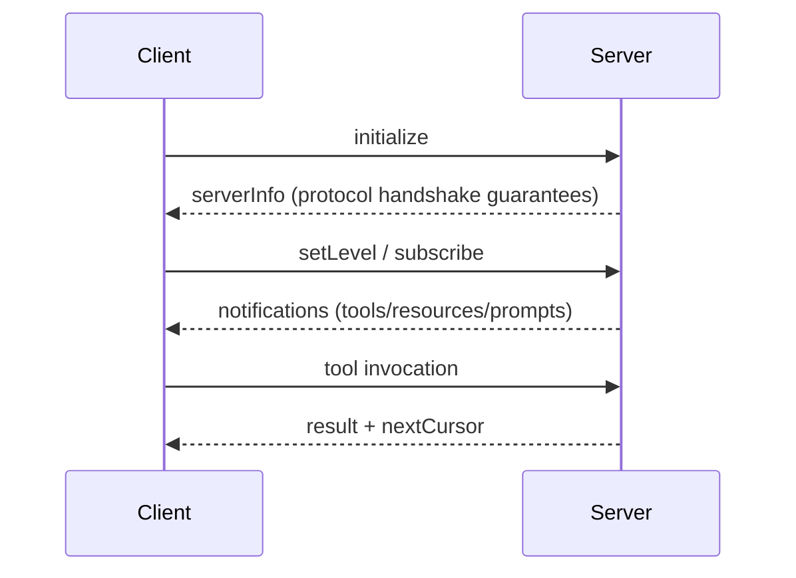

# mcp-bash Best Practices Guide

This guide distils hands-on recommendations for designing, building, and operating Model Context Protocol (MCP) servers with `mcp-bash`. It complements the normative guarantees tracked in [SPEC-COMPLIANCE.md](../SPEC-COMPLIANCE.md), the onboarding cues in [README.md](../README.md), and the workflows in [TESTING.md](../TESTING.md).

## Table of contents
- [Quick reference index](#quick-reference-index)
- [1. Introduction](#1-introduction)
- [2. Environment & tooling](#2-environment--tooling)
- [3. Project layout primer](#3-project-layout-primer)
- [4. MCP server development best practices](#4-mcp-server-development-best-practices)
- [5. Testing & quality gates](#5-testing--quality-gates)
- [6. Operational guidance](#6-operational-guidance)
- [7. Security & compliance](#7-security--compliance)
- [8. Performance & limits](#8-performance--limits)
- [9. Integration patterns](#9-integration-patterns)
- [10. Contribution workflow](#10-contribution-workflow)
- [11. Resources & further reading](#11-resources--further-reading)
- [12. Appendices](#12-appendices)
- [Doc changelog](#doc-changelog)

## Quick reference index

### Commands
| Command | Purpose | Linked section |
| --- | --- | --- |
| `bin/mcp-bash scaffold tool <name>` | Create SDK-ready tool skeleton (metadata + script) | [§4.1](#41-scaffold-workflow) |
| `bin/mcp-bash scaffold prompt <name>` | Generate prompt template + `.meta.json` | [§4.1](#41-scaffold-workflow) |
| `bin/mcp-bash scaffold resource <name>` | Produce resource boilerplate wired to the file provider | [§4.1](#41-scaffold-workflow) |
| `bin/mcp-bash scaffold test` | Create a lightweight test harness (`test/run.sh`, `test/README.md`) | [§4.1](#41-scaffold-workflow) |
| `bin/mcp-bash run-tool <name>` | Invoke a tool without starting the server (supports `--dry-run`, `--roots`, `--timeout`, `--verbose`, `--minimal`, `--print-env`) | [§5.2](#52-local-workflow) |
| `bin/mcp-bash validate` | Validate project structure and metadata (`--json`, `--strict`, `--explain-defaults` for CI, `--inspector` for MCP Inspector CLI validation) | [§5.2](#52-local-workflow) |
| `bin/mcp-bash doctor` | Diagnose environment and installation issues (`--json` for CI/log parsing; `--dry-run`/`--fix` for managed-install repair) | [§2](#2-environment--tooling) |
| `bin/mcp-bash registry status` | Show registry cache status (hash/mtime/counts) | [§5.2](#52-local-workflow) |
| `./test/lint.sh` | Run shellcheck + shfmt gates; wraps commands from [TESTING.md](../TESTING.md) | [§5.2](#52-local-workflow) |
| `./test/unit/run.sh` | Run unit tests (pass one or more `*.bats` to filter) | [§5.1](#51-test-pyramid) |
| `./test/integration/test_capabilities.sh` | End-to-end lifecycle/capability checks | [§5.3](#53-ci-triage-matrix) |
| `./test/examples/test_examples.sh` | Smoke runner ensuring scaffolds/examples stay healthy | [§5.1](#51-test-pyramid) |
| `MCPBASH_LOG_LEVEL=debug bin/mcp-bash` | Start server with verbose diagnostics ([README.md](../README.md#diagnostics--logging)) | [§6.3](#63-monitoring-and-health) |

### SDK helpers (quick reference)
| Helper | Purpose | Example |
| --- | --- | --- |
| `mcp_args_require` | Extract required string, fail if missing | `name="$(mcp_args_require '.name')"` |
| `mcp_args_bool` | Parse boolean with truthy coercion | `all="$(mcp_args_bool '.all' --default false)"` |
| `mcp_args_int` | Parse integer with range validation | `count="$(mcp_args_int '.count' --default 10 --min 1 --max 200)"` |
| `mcp_args_get` | Low-level jq extraction | `val="$(mcp_args_get '.nested.field // ""')"` |
| `mcp_require_path` | Validate path against MCP roots | `path="$(mcp_require_path '.path' --default-to-single-root)"` |
| `mcp_emit_json` | Emit JSON result | `mcp_emit_json '{"status":"ok"}'` |
| `mcp_json_obj` | Build JSON object from pairs | `mcp_json_obj status ok msg "done"` |
| `mcp_fail_invalid_args` | Return -32602 error | `mcp_fail_invalid_args "count must be positive"` |
| `mcp_progress` | Report progress | `mcp_progress 50 "Halfway done" 100` |
| `mcp_is_cancelled` | Check cancellation | `if mcp_is_cancelled; then exit 1; fi` |
| `mcp_log_info` | Structured logging | `mcp_log_info "tool" "message"` |
| `mcp_with_retry` | Retry with exponential backoff | `mcp_with_retry 3 1.0 -- curl -sf "$url"` |
| `mcp_download_safe` | SSRF-safe HTTPS download | `mcp_download_safe --url "$url" --allow "api.example.com"` |
| `mcp_download_safe_or_fail` | SSRF-safe download (fails on error) | `path=$(mcp_download_safe_or_fail --url "$url" --out "$tmp" --allow "x.com")` |
| `mcp_result_success` | Emit success CallToolResult envelope | `mcp_result_success "$json_data"` |
| `mcp_result_error` | Emit error CallToolResult envelope | `mcp_result_error '{"type":"not_found"}'` |
| `mcp_error` | Convenience error helper with hints | `mcp_error "not_found" "User missing" --hint "Check ID"` |
| `mcp_result_text_with_resource` | Combined text + embedded resources | `mcp_result_text_with_resource "$json" --path /tmp/out.txt` |
| `mcp_json_truncate` | Truncate large arrays for context limits | `mcp_json_truncate "$arr" 10000` |
| `mcp_is_valid_json` | Validate single JSON value | `if mcp_is_valid_json "$val"; then ...` |
| `mcp_byte_length` | UTF-8 safe byte length | `len=$(mcp_byte_length "$str")` |
| `mcp_extract_cli_error` | Extract error from CLI stdout JSON or stderr | `msg=$(mcp_extract_cli_error "$stdout" "$stderr" "$exit_code")` |
| `mcp_run_with_progress` | Forward subprocess progress to MCP | `mcp_run_with_progress --pattern '([0-9]+)%' --extract match1 -- wget ...` |
| `mcp_config_load` | Load configuration from env/file/defaults | `mcp_config_load --env MY_CONFIG --file ./config.json --defaults '{}'` |
| `mcp_config_get` | Get value from loaded configuration | `timeout=$(mcp_config_get '.timeout' --default 30)` |

### External command patterns
| Pattern | Purpose | Example |
| --- | --- | --- |
| `cmd \| jq '...' \|\| echo '{}'` | Safe jq pipeline with fallback | `data=$(mycli get "$id" 2>/dev/null \| jq '.data // {}' \|\| echo '{}')` |
| `cmd 2>/dev/null \|\| echo '{...}'` | JSON fallback on CLI failure | `result=$(mycli query 2>/dev/null \|\| echo '{"items":[]}')` |
| `mcp_with_retry N delay -- cmd` | Retry transient failures | `mcp_with_retry 3 1.0 -- curl -sf "$url" \| jq '.' \|\| echo '{}'` |

### Environment variables
| Variable | Description | Notes |
| --- | --- | --- |
| `MCPBASH_FORCE_MINIMAL` | Forces the minimal capability tier even when JSON tooling is available | Useful for testing degraded mode per [README.md](../README.md#runtime-detection) |
| `MCPBASH_LOG_LEVEL` / `MCPBASH_LOG_LEVEL_DEFAULT` | Sets startup log verbosity (`info` default) | Harmonises with `logging/setLevel` requests; see [§6.2](#62-logging-tracing-and-metrics) |
| `MCPBASH_LOG_VERBOSE` | Exposes full paths and manual-registration script output in logs | **Security risk**: reveals file paths, usernames, cache locations. Use only in trusted environments; see [docs/LOGGING.md](LOGGING.md) |
| `MCPBASH_DEBUG_PAYLOADS` | Persists per-message payload logs under `${TMPDIR}/mcpbash.state.*` | Enable only during targeted debugging (storage heavy) |
| `MCPBASH_MAX_CONCURRENT_REQUESTS` | Caps worker count (default 16 per [docs/LIMITS.md](LIMITS.md)) | Right-size before shipping to resource-constrained hosts |
| `MCPBASH_MAX_PROGRESS_PER_MIN` / `MCPBASH_MAX_LOGS_PER_MIN` | Throttle progress/log notifications per request | Raise with caution to avoid client overload |
| `MCP_TOOLS_TTL`, `MCP_RESOURCES_TTL`, `MCP_PROMPTS_TTL` | Control registry cache lifetime ([docs/REGISTRY.md](REGISTRY.md#ttl-and-regeneration)) | Lower values increase IO load |
| `MCP_RESOURCES_ROOTS` | Restricts file/resource providers to approved roots ([docs/SECURITY.md](SECURITY.md)) | Mandatory for multi-tenant deployments |
| `MCPBASH_REGISTRY_MAX_BYTES` | Hard stop for registry cache size | Keep aligned with operator storage policies |
| `MCPBASH_HTTPS_ALLOW_HOSTS` / `MCPBASH_HTTPS_DENY_HOSTS` | Allow/deny lists (space/comma separated) for HTTPS resource hosts | Private/loopback always blocked; **allow list required** unless `MCPBASH_HTTPS_ALLOW_ALL=true`; redirects disabled; timeouts/size capped (see docs/SECURITY.md) |
| `MCPBASH_HTTPS_TIMEOUT` / `MCPBASH_HTTPS_MAX_BYTES` | HTTPS provider timeout/size controls | Capped internally (timeout ≤60s, max bytes ≤20MB) |
| `MCPBASH_ENABLE_GIT_PROVIDER` | Enable git+https:// resource provider | Default disabled; set to `true` to allow git+https:// |
| `MCPBASH_GIT_ALLOW_HOSTS` / `MCPBASH_GIT_DENY_HOSTS` | Optional allow/deny lists for git resource hosts | Private/loopback always blocked |
| `MCPBASH_GIT_TIMEOUT` / `MCPBASH_GIT_MAX_KB` | Git provider timeout/size controls | Capped internally (timeout ≤60s, max size ≤1GB; default 50MB) |

### Troubleshooting keywords
- **Minimal mode** – server only exposes lifecycle/ping/logging; often triggered by missing `jq`/`gojq` or forced via `MCPBASH_FORCE_MINIMAL`.
- **Compatibility toggles** – `MCPBASH_COMPAT_BATCHES` re-enables legacy JSON-RPC batch arrays for clients using newer protocols; protocol `2025-03-26` accepts arrays automatically.
- **Discovery churn** – `notifications/*/list_changed` loops may indicate fast TTLs or manual registry overrides; inspect `.registry/*.json`.
- **Cancellation** – `mcp_is_cancelled` returning true mid-tool (see `examples/03-progress-and-cancellation/tools/slow/tool.sh:5`) highlights clients timing out; revisit tool timeouts and progress cadence.
- **Progress throttling** – hitting the 100/minute default triggers warning logs and truncated progress; adjust `MCPBASH_MAX_PROGRESS_PER_MIN` when high-frequency updates matter.

## 1. Introduction
- **Protocol alignment** – Every practice references the corresponding guarantees tracked in [SPEC-COMPLIANCE.md](../SPEC-COMPLIANCE.md). Use this guide for actionable advice; use the coverage matrix to confirm parity with the protocol.
- **When to choose mcp-bash** – Prefer this implementation when Bash-only deployments, stdio transports, portable tooling, or zero-dependency sandboxes are required. Reach for other stacks when you need native gRPC transports, long-lived HTTP streaming, or language-specific runtimes.
- **Document scope** – Focuses on day-2 operations, maintainability, and collaboration across tool/prompt authors, operators, and contributors. Feature requests, product positioning, and localization are intentionally out of scope (§Out-of-Scope in the original plan).

## 2. Environment & tooling
- **Runtime prerequisites** – Bash ≥3.2, POSIX coreutils, and one JSON parser (`gojq` or `jq`) per [README.md](../README.md#runtime-detection). Confirm capability mode by piping a ping request through the server:
  ```
  printf '{"jsonrpc":"2.0","id":1,"method":"ping"}\n' | bin/mcp-bash
  ```
  A healthy install responds with `{"jsonrpc":"2.0","id":1,"result":{}}`.
- **Lint/format requirements** – Install `shellcheck` and `shfmt` before running `./test/lint.sh`. Without `shfmt`, lint fails with `Required command "shfmt" not found in PATH` (see [README.md](../README.md#developer-prerequisites)).
- **Recommended tooling bundle**:

| Tool | Check command | Notes |
| --- | --- | --- |
| `gojq` or `jq` | `jq --version` | Deterministic JSON handling unlocks full capability mode. |
| `shellcheck` | `shellcheck --version` | Required by lint. |
| `shfmt` | `shfmt --version` | Enforces consistent indentation/formatting. |
| `rg` | `rg --version` | Useful for repo-wide metadata scans. |

- **Debugging helpers** – Keep `asciinema` or screen-recording ready when capturing scaffold workflows for documentation. Add captions/alt-text for accessibility per §Supporting Assets.

## 3. Project layout primer
- **Stable vs extension directories** – Core runtime sits under `bin/`, `lib/`, `handlers/`, `providers/`, and `sdk/`. Extension-friendly directories include `tools/`, `resources/`, `prompts/`, `server.d/`, and `.registry/` as illustrated in [README.md](../README.md#repository-layout).
- **Registration flows**:
  - *Auto-discovery* – Default path scanning populates `.registry/*.json` (see [docs/REGISTRY.md](REGISTRY.md)). Metadata is sourced from `.meta.json` then inline `# mcp:` annotations, falling back to defaults.
  - *Declarative registration* – Prefer `server.d/register.json` for deterministic overrides/disablement without executing shell code (see [docs/REGISTRY.md](REGISTRY.md)). Use `[]` to explicitly disable a kind, or omit/null a key to fall through to auto-discovery.
  - *Hook registration* – Use `server.d/register.sh` only for dynamic/imperative cases; it executes shell code and is opt-in (`MCPBASH_ALLOW_PROJECT_HOOKS=true`). See `examples/advanced/register-sh-hooks/`.
- **Environment staging** – Use `server.d/env.sh` to inject operator-specific configuration without editing tracked files. Document each variable inline for future maintainers.

## 4. MCP server development best practices

### 4.1 Scaffold workflow
1. Run `bin/mcp-bash scaffold <type> <name>` to create the initial directory structure.
2. Inspect the generated README/snippets, then layer your logic into `tools/<name>/tool.sh` (or equivalent prompts/resources).
3. Add unit/integration coverage hitting the new artifacts (see [§5](#5-testing--quality-gates)).
4. Update docs referencing the new capability, especially if operator steps, limits, or troubleshooting expectations shift.

The scaffolder and examples use a per-tool directory (for example `tools/hello/tool.sh`), and automatic discovery now requires tools to live under subdirectories of `tools/` (root-level scripts like `tools/foo.sh` are ignored). Stay consistent within a project.

Use `bin/mcp-bash scaffold test` inside an existing project to generate a minimal harness (`test/run.sh`, `test/README.md`) that wraps `run-tool` for quick smoke tests. The command refuses to overwrite existing files, so remove stale test assets before re-scaffolding.

_Asciinema tip_: Record a short run of `bin/mcp-bash scaffold tool sample.hello` plus `./test/examples/test_examples.sh` so newcomers can view the workflow end-to-end.

### 4.2 LLM-friendly tool metadata

When LLMs use your MCP tools, the only context they have is your metadata. Rich descriptions directly improve tool selection accuracy and reduce errors.

**Key practices:**

1. **Write multi-line descriptions** - Include "when to use", "when NOT to use", and examples:
   ```json
   {
     "description": "Export entries from a list.\n\nWhen to use: Retrieve entities belonging to a specific list.\nNot for: Searching all entities globally (use entity-search).\n\nExamples:\n- list-export --list-id 123\n- list-export --list-id 456 --filter 'Status=Active'"
   }
   ```

2. **Document every parameter** - Include format, valid values, and examples:
   ```json
   {
     "filter": {
       "type": "string",
       "description": "Filter expression. Operators: = != ~= (contains). Example: 'Status=Active'"
     }
   }
   ```

3. **Create domain model resources** - For complex domains, provide a resource explaining your data model that LLMs can reference.

4. **Include workflow hints** - Mention related tools and typical sequences in descriptions.

See [docs/LLM-CONTEXT.md](LLM-CONTEXT.md) for comprehensive patterns and a documentation checklist.

### 4.3 SDK usage patterns

The SDK (`sdk/tool-sdk.sh`) provides helpers that eliminate boilerplate and ensure consistent behavior across tools. Source it at the top of every tool script:

```bash
#!/usr/bin/env bash
set -euo pipefail
source "${MCP_SDK:?MCP_SDK environment variable not set}/tool-sdk.sh"
```

#### Argument parsing helpers

**`mcp_args_require`** – Extract a required string value; fails with `-32602` if missing/null:

```bash
# Fails with "target is required" if .target is missing or null
target="$(mcp_args_require '.target' 'target is required')"

# Default message uses the pointer name
name="$(mcp_args_require '.name')"  # Fails with ".name is required"
```

**`mcp_args_bool`** – Parse boolean with truthy coercion (`true`/`1` → `"true"`, else `"false"`):

```bash
# Returns "true" or "false"; defaults to "false" if missing
all="$(mcp_args_bool '.all' --default false)"

# Without --default, missing value fails with invalid-args
verbose="$(mcp_args_bool '.verbose')"  # Requires explicit value
```

**`mcp_args_int`** – Parse integer with optional range validation:

```bash
# With default and range validation
count="$(mcp_args_int '.count' --default 10 --min 1 --max 200)"

# Just default, no range
limit="$(mcp_args_int '.limit' --default 50)"

# Required integer with range
page="$(mcp_args_int '.page' --min 1)"  # Fails if missing or < 1
```

**`mcp_args_get`** – Low-level extraction for complex shapes; returns raw jq output:

```bash
# Extract with jq filter and default
name="$(mcp_args_get '.name // "World"')"

# Extract nested value
config="$(mcp_args_get '.options.config // empty')"

# Check if key exists
if [ "$(mcp_args_get '.debug // "false"')" = "true" ]; then
  # debug mode
fi
```

> **Note**: `mcp_args_get` requires JSON tooling (jq/gojq). In minimal mode it returns exit code 1, which will terminate scripts using `set -e`. For minimal-mode compatibility, use `mcp_args_get ... 2>/dev/null || true` or prefer the typed helpers (`mcp_args_bool`, `mcp_args_int`) which accept `--default` values that work in minimal mode.

#### Path validation with roots enforcement

**`mcp_require_path`** – Validate and normalize paths with MCP roots enforcement:

```bash
# Basic required path (validates against configured roots)
target_path="$(mcp_require_path '.targetPath')"

# Default to single root when client has exactly one root configured
repo_path="$(mcp_require_path '.repoPath' --default-to-single-root)"

# Allow empty (returns empty string if not provided)
optional_path="$(mcp_require_path '.outputPath' --allow-empty)"
```

#### Centralized tool policy (server.d/policy.sh)

- Use `server.d/policy.sh` with `mcp_tools_policy_check()` to gate tool invocations in one place (read-only modes, allowlists, audit hooks). The framework sources this once per process and calls it before every tool run.
- Keep the hook fast and deterministic; it runs on every invocation.
- Use `-32602` for policy/invalid-params blocks; `-32600` for capability/auth failures.
- Example read-only mode:

```bash
# server.d/policy.sh
mcp_tools_policy_check() {
	local tool_name="$1"
	if [ "${MYPROJECT_READ_ONLY:-0}" = "1" ] && [[ "${tool_name}" != myProj.get* ]]; then
		mcp_tools_error -32602 "Read-only mode: ${tool_name} disabled"
		return 1
	fi
	return 0
}
```

This single helper replaces 15-20 lines of boilerplate:

```bash
# BEFORE: Manual path validation (don't do this)
roots_count="$(mcp_roots_count 2>/dev/null || printf '0')"
if [ -n "${repo_path_arg}" ]; then
  repo_path="${repo_path_arg}"
else
  if [ "${roots_count}" -eq 1 ]; then
    repo_path="$(mcp_roots_list | head -n1)"
  else
    mcp_fail_invalid_args "repoPath is required when zero or multiple roots are configured"
  fi
fi
if [ "${roots_count}" -gt 0 ] && ! mcp_roots_contains "${repo_path}"; then
  mcp_fail_invalid_args "repoPath is outside configured MCP roots"
fi
if command -v realpath >/dev/null 2>&1; then
  repo_path="$(realpath "${repo_path}")"
fi

# AFTER: One line with mcp_require_path
repo_path="$(mcp_require_path '.repoPath' --default-to-single-root)"
```

#### External dependency health checks (server.d/health-checks.sh)

Use `server.d/health-checks.sh` to verify external dependencies (CLIs, environment variables) are available before the server starts serving requests. The `mcp-bash health` command runs these checks.

```bash
#!/usr/bin/env bash
# server.d/health-checks.sh - verify external dependencies

# Check required CLI tools
mcp_health_check_command "xaffinity" "Affinity CLI"
mcp_health_check_command "jq" "JSON processor"

# Check required environment variables
mcp_health_check_env "AFFINITY_API_KEY" "Affinity API key"
mcp_health_check_env "MY_API_TOKEN" "Service API token"
```

The helpers print checkmarks/crosses and return appropriate exit codes:
- `mcp_health_check_command <cmd> [message]` – Verifies command exists in PATH
- `mcp_health_check_env <var> [message]` – Verifies environment variable is set

Health check results appear in `mcp-bash health` output:
```json
{"status":"ok","projectChecks":"ok",...}
```

#### Roots helpers

Tools can query the client-provided roots:

```bash
# Get count of configured roots
count="$(mcp_roots_count)"

# List all root paths (newline-separated)
mcp_roots_list | while read -r root; do
  echo "Root: ${root}"
done

# Check if a path is within configured roots
if mcp_roots_contains "/some/path"; then
  echo "Path is allowed"
fi
```

#### Structured outputs

**`mcp_emit_json`** – Emit JSON result (compacted if JSON tooling available):

```bash
mcp_emit_json '{"status":"ok","count":42}'
```

**`mcp_json_obj`** – Build JSON objects from key/value pairs (all values stringified):

```bash
# Simple object
mcp_emit_json "$(mcp_json_obj status ok message "Operation completed")"
# Output: {"status":"ok","message":"Operation completed"}

# Multiple fields
mcp_emit_json "$(mcp_json_obj \
  status ok \
  message "Rebase completed" \
  repoPath "${repo_path}" \
  newHead "${new_head}" \
)"
```

**`mcp_json_arr`** – Build JSON arrays:

```bash
mcp_emit_json "$(mcp_json_arr "item1" "item2" "item3")"
# Output: ["item1","item2","item3"]
```

**`mcp_emit_text`** – Emit plain text result:

```bash
mcp_emit_text "Hello, ${name}!"
```

#### Embedded resources (`type:"resource"`)

Add file content to the `result.content` array so clients receive both text and attached files:

**Preferred: Use `mcp_result_text_with_resource`**
```bash
payload_path="${MCPBASH_PROJECT_ROOT}/resources/report.txt"
printf 'Report content' >"${payload_path}"
mcp_result_text_with_resource \
  "$(mcp_json_obj message "See embedded report")" \
  --path "${payload_path}" --mime text/plain
```

See [Embedding resources in tool responses](#embedding-resources-in-tool-responses) for full documentation.

**Manual approach** (for advanced cases):
- Write to `MCP_TOOL_RESOURCES_FILE` directly. TSV format: `path<TAB>mimeType<TAB>uri` (mime/uri optional).
- JSON format is also accepted: `[{"path":"/tmp/result.png","mimeType":"image/png","uri":"file:///tmp/result.png"}]`
- Binary files are base64-encoded into the `blob` field; text stays in `text`.
- Keep paths inside allowed roots; invalid/unreadable entries are skipped (debug logs will mention the skip).

#### Error handling

**`mcp_fail`** – Return structured JSON-RPC error and exit:

```bash
# Generic failure with code
mcp_fail -32603 "Internal error" '{"detail":"something broke"}'

# Invalid arguments (code -32602)
mcp_fail_invalid_args "count must be positive"
mcp_fail_invalid_args "invalid config" '{"field":"count","value":-1}'
```

#### Progress & cancellation

**`mcp_progress`** – Report progress (throttled by framework):

```bash
mcp_progress 25 "Processing files..." 100  # 25%, message, total
mcp_progress 50 "Halfway done"             # 50%, message, no total
```

**`mcp_is_cancelled`** – Check if client requested cancellation:

```bash
for i in $(seq 1 100); do
  if mcp_is_cancelled; then
    mcp_fail -32001 "Operation cancelled"
  fi
  # do work...
  mcp_progress "${i}" "Processing item ${i}"
done
```

**Progress-aware timeout extension** – Long-running tools that emit progress can extend their timeout automatically. When enabled, the timeout resets each time progress is written, allowing legitimate operations to run longer while still catching truly stuck tools.

Enable globally via environment:
```bash
export MCPBASH_PROGRESS_EXTENDS_TIMEOUT=true
export MCPBASH_MAX_TIMEOUT_SECS=300  # Hard cap (default: 600s)
```

Or per-tool in `tool.meta.json`:
```json
{
  "timeoutSecs": 30,
  "progressExtendsTimeout": true,
  "maxTimeoutSecs": 300
}
```

**Important**: The client must provide a `progressToken` in the request for progress to be written. Emit progress every ~5 seconds to keep the timeout from triggering.

#### Logging

Use structured logging instead of `echo` to stderr:

```bash
mcp_log_debug "mytool" "Starting operation"
mcp_log_info "mytool" "Processing ${count} items"
mcp_log_warn "mytool" "Deprecated option used"
mcp_log_error "mytool" "Failed to connect"
```

#### Secure downloads (mcp_download_safe)

**`mcp_download_safe`** – Download content from HTTPS URLs with SSRF protection:

```bash
# Basic usage with explicit allowlist
result=$(mcp_download_safe --url "https://api.example.com/data" --out "/tmp/data.json" --allow "api.example.com")
if [[ $(echo "$result" | jq -r '.success') == "true" ]]; then
  cat /tmp/data.json  # Process downloaded file
else
  error=$(echo "$result" | jq -r '.error.message')
  mcp_log_error "mytool" "Download failed: ${error}"
fi

# Using environment variable for allowlist (useful for CI/operator config)
export MCPBASH_HTTPS_ALLOW_HOSTS="api.example.com,cdn.example.com"
result=$(mcp_download_safe --url "$url" --out "/tmp/data.json")

# Custom timeout and max size
result=$(mcp_download_safe --url "$url" --out "/tmp/data.json" --allow "example.com" \
  --timeout 30 --max-bytes 5242880)

# Custom User-Agent
result=$(mcp_download_safe --url "$url" --out "/tmp/data.json" --allow "example.com" \
  --user-agent "my-tool/1.0")
```

**Return format** – Always returns JSON with exit code 0 (safe for `set -e`):

```json
// Success:
{"success":true,"bytes":<size>,"path":"<output_path>"}

// Error:
{"success":false,"error":{"type":"<error_type>","message":"<message>"}}
```

**Error types** (in `.error.type`):
- `invalid_url` – URL is empty or not https://
- `invalid_params` – Invalid/missing parameters (e.g., missing --out, non-numeric --timeout)
- `host_blocked` – Host is private, obfuscated, or not in allowlist
- `provider_unavailable` – HTTPS provider not found or curl missing
- `network_error` – Connection failed (retries exhausted)
- `size_exceeded` – Response exceeds --max-bytes limit
- `write_error` – Could not write to output path
- `provider_error` – Provider script failed unexpectedly
- `redirect` – URL returned 3xx redirect (location in `.error.location`)

**Security features**:
- SSRF protection: Blocks private IPs (127.x, 10.x, 192.168.x, etc.) and DNS rebinding
- Deny-by-default: Requires explicit host allowlist
- Obfuscated IP detection: Rejects integer/hex IP literals
- No redirects: Prevents redirect-based SSRF attacks
- Automatic retry: Exponential backoff for transient failures

**Simple usage with `mcp_download_safe_or_fail`:**

For tools that should fail on download error (most cases):

```bash
# Downloads or fails tool with -32602
path=$(mcp_download_safe_or_fail --url "https://api.example.com/data" \
  --out "/tmp/data.json" --allow "api.example.com")
process_file "$path"
```

**Handling redirects:**

URLs that redirect return a `redirect` error with the target location:

```bash
result=$(mcp_download_safe --url "$url" --out "$tmp" --allow "example.com")
if [[ $(echo "$result" | jq -r '.error.type') == "redirect" ]]; then
  target=$(echo "$result" | jq -r '.error.location')
  mcp_log_info "mytool" "Hint: use ${target} instead"
fi
```

#### Configuration loading

**`mcp_config_load`** – Load and merge configuration from multiple sources:

```bash
# Load config with precedence: env var > file > example > defaults
mcp_config_load \
  --env MY_TOOL_CONFIG \
  --file "${MCPBASH_PROJECT_ROOT}/config.json" \
  --example "${MCPBASH_PROJECT_ROOT}/config.example.json" \
  --defaults '{"timeout": 30, "retries": 3}'
```

**Precedence (highest to lowest):**
1. Env var (`--env`) – Can contain JSON directly or path to a config file
2. Config file (`--file`)
3. Example file (`--example`)
4. Inline defaults (`--defaults`)

**Behavior:**
- Shallow merge: later sources override earlier at top level
- Missing files are silently skipped (not errors)
- Invalid JSON logs warning and skips that source
- Result stored in `MCP_CONFIG_JSON` env var

**`mcp_config_get`** – Get values from loaded configuration:

```bash
# Get required value (fails if missing)
api_key=$(mcp_config_get '.api.key') || mcp_fail_invalid_args "Missing config: api.key"

# Get optional value with default
timeout=$(mcp_config_get '.timeout' --default 30)

# Get nested value (requires jq; minimal mode only supports top-level keys)
endpoint=$(mcp_config_get '.api.endpoint' --default 'https://api.example.com')
```

**Complete example:**

```bash
#!/usr/bin/env bash
set -euo pipefail
source "${MCP_SDK:?}/tool-sdk.sh"

# Load configuration
mcp_config_load \
  --env MY_TOOL_CONFIG \
  --file "${MCPBASH_PROJECT_ROOT}/config.json" \
  --defaults '{"timeout": 30, "retries": 3}'

# Get values
api_key=$(mcp_config_get '.api_key') || mcp_fail_invalid_args "Missing api_key in config"
timeout=$(mcp_config_get '.timeout' --default 30)
retries=$(mcp_config_get '.retries' --default 3)

# Use configuration
mcp_log_info "mytool" "Using timeout=${timeout}, retries=${retries}"
```

**Minimal mode notes:**
- Without jq: merge uses last-source-wins (not shallow merge)
- `mcp_config_get`: Only top-level simple keys supported (`.key`)
- Nested paths (`.api.endpoint`) return default or fail in minimal mode

#### Elicitation (interactive prompts)

Request user input when the client supports elicitation:

```bash
# Simple string input
response="$(mcp_elicit_string "Enter your name:" "name")"

# Yes/no confirmation
response="$(mcp_elicit_confirm "Proceed with deletion?")"

# Choice from options
response="$(mcp_elicit_choice "Select environment:" "dev" "staging" "prod")"

# Custom schema
schema='{"type":"object","properties":{"port":{"type":"integer"}},"required":["port"]}'
response="$(mcp_elicit "Configure server:" "${schema}")"
```

#### Complete tool example

```bash
#!/usr/bin/env bash
set -euo pipefail
source "${MCP_SDK:?}/tool-sdk.sh"

# Parse arguments with validation
repo_path="$(mcp_require_path '.repoPath' --default-to-single-root)"
count="$(mcp_args_int '.count' --default 10 --min 1 --max 200)"
all="$(mcp_args_bool '.all' --default false)"

mcp_log_info "my-tool" "Processing ${count} items in ${repo_path}"

# Check for cancellation in long operations
for i in $(seq 1 "${count}"); do
  if mcp_is_cancelled; then
    mcp_fail -32001 "Cancelled by user"
  fi
  mcp_progress "${i}" "Processing item ${i}" "${count}"
  # ... do work ...
done

# Return structured result
mcp_result_success "$(mcp_json_obj \
  status ok \
  message "Processed ${count} items" \
  path "${repo_path}" \
)"
```

#### Timeouts

Set per-tool `timeoutSecs` inside `<tool>.meta.json` when default (30 seconds) is too high/low:

```json
{
  "name": "long-running-tool",
  "description": "A tool that needs more time",
  "timeoutSecs": 120,
  "inputSchema": { ... }
}
```

#### Tool annotations

Declare behavior hints in `<tool>.meta.json` to help clients present appropriate UI cues (MCP 2025-03-26):

```json
{
  "name": "file-delete",
  "description": "Delete a file from the filesystem",
  "inputSchema": { ... },
  "annotations": {
    "readOnlyHint": false,
    "destructiveHint": true,
    "idempotentHint": true,
    "openWorldHint": false
  }
}
```

| Annotation | Default | Description |
|------------|---------|-------------|
| `readOnlyHint` | `false` | Tool does not modify its environment |
| `destructiveHint` | `true` | Tool may destructively modify environment (only when `readOnlyHint` is `false`) |
| `idempotentHint` | `false` | Multiple calls with same args have same effect as one call |
| `openWorldHint` | `true` | Tool may interact with external systems |

Clients may use these hints to show confirmation dialogs, group tools by risk level, or enable/disable tools based on user preferences. Annotations are advisory—do not rely on them for security decisions.

#### Shared code

Place reusable scripts under `lib/` in your project and source them via `MCPBASH_PROJECT_ROOT`:

```bash
# tools/my-tool/tool.sh
# shellcheck source=../../lib/helpers.sh disable=SC1091
source "${MCPBASH_PROJECT_ROOT}/lib/helpers.sh"
```

Keep shared code under project roots to avoid leaking out-of-scope paths; consider a `lib/` README to describe available helpers.

### 4.4 Error handling patterns

MCP distinguishes between **Protocol Errors** and **Tool Execution Errors**. This distinction is critical for enabling LLM self-correction. See [docs/ERRORS.md](ERRORS.md) for the full reference.

#### Protocol Errors vs Tool Execution Errors

| Error Type | When to Use | LLM Can Self-Correct? |
|------------|-------------|----------------------|
| Protocol Error (`-32xxx`) | Malformed request, unknown tool, server failures | ❌ No |
| Tool Execution Error (`isError: true`) | Invalid input the LLM could fix | ✅ Yes |

**Key insight:** When a tool receives valid JSON but the *values* are wrong (bad date, out-of-range number, invalid path), return a Tool Execution Error so the LLM can retry with corrected input.

```bash
#!/usr/bin/env bash
source "${MCP_SDK:?}/tool-sdk.sh"

count="$(mcp_args_get '.count // 10')"

# ❌ DON'T use Protocol Error for correctable input issues
# mcp_fail_invalid_args "count must be positive"  # Returns -32602

# ✅ DO provide actionable feedback the LLM can learn from
if [ "${count}" -lt 1 ]; then
  mcp_result_error "$(mcp_json_obj \
    error "count must be between 1 and 100" \
    received "${count}" \
    suggestion "Try count=10 for a reasonable default"
  )"
fi
```

#### When to use each error type

**Use Protocol Errors (`mcp_fail`) for:**
- Missing required parameters that the SDK can't default
- Truly malformed input (not JSON, wrong types)
- Authorization/permission failures
- Internal server errors

**Use Tool Execution Errors (exit non-zero with message) for:**
- Values out of valid range
- Invalid formats (dates, emails, paths)
- Business logic failures ("file not found", "API rate limited")
- Any case where your error message teaches the LLM how to fix it

#### SDK helpers

```bash
# Protocol error (tool stops, error goes to client)
mcp_fail -32602 "authorization required"
mcp_fail_invalid_args "targetPath is required"

# Tool execution error (LLM gets actionable feedback)
if [ ! -f "${target_path}" ]; then
  mcp_result_error "$(mcp_json_obj \
    error "File not found" \
    path "${target_path}" \
    hint "Check available files with list-files tool"
  )"
fi
```

#### General guidelines

- Use `mcp_fail` (or `mcp_fail_invalid_args`) to return structured JSON-RPC errors with proper `code/message/data` directly from tools; it survives `tool_env_mode=minimal/allowlist` via the injected `MCP_TOOL_ERROR_FILE`.
- Only return `-32603` (internal error) for unknown failures; otherwise map to specific JSON-RPC errors spelled out in the protocol.
- Capture stderr and propagate actionable diagnostics; see `examples/01-args-and-validation/tools/echo-arg/tool.sh:30-36` for human-readable error surfaces.
- Wrap risky filesystem/network calls in helper functions so they can be retried or mocked in unit tests.
- For richer tool failure context, enable `MCPBASH_TOOL_STDERR_CAPTURE` and tune `MCPBASH_TOOL_STDERR_TAIL_LIMIT` (default 4096 bytes). Timeouts include exit code and stderr tail when `MCPBASH_TOOL_TIMEOUT_CAPTURE` is on (default).
- For tricky shell tools, opt into tracing with `MCPBASH_TRACE_TOOLS=true`; traces go to per-invocation logs under `MCPBASH_STATE_DIR` (cap via `MCPBASH_TRACE_MAX_BYTES`, adjust PS4 with `MCPBASH_TRACE_PS4`). SDK helpers suppress xtrace around secret-bearing args/_meta payload expansions, but tools can still leak secrets if they print values explicitly. Trace lines are added to `error.data.traceLine` when enabled.

#### Calling external CLI tools

When your tool wraps external commands (CLIs, APIs via curl, etc.), handle failures explicitly to avoid empty output breaking jq pipelines.

**Anti-pattern (fails silently):**
```bash
# ❌ If external_cli fails, $data becomes empty string, then jq fails with "invalid JSON"
data=$(external_cli get-entity "$id" 2>/dev/null | jq -c '.data')
```

**Correct pattern (with fallback):**
```bash
# ✅ Two-layer defense: jq handles null/missing keys, || handles empty stdin
data=$(external_cli get-entity "$id" 2>/dev/null | jq -c '.data // {}' || echo '{}')

# For arrays:
items=$(external_cli list-items 2>/dev/null | jq -c '.items // []' || echo '[]')
```

**Why this matters:**
- `2>/dev/null` hides CLI stderr but still produces empty stdout on failure
- Empty string piped to jq causes: `jq: parse error (unexpected end of input)`
- This breaks `--argjson` when building composite responses

**Composing multiple external sources:**
```bash
# Fetch data from multiple sources with fallbacks
entity=$(my_cli entity get "$id" 2>/dev/null | jq -c '.data.entity // {}' || echo '{}')
notes=$(my_cli notes ls --entity-id "$id" 2>/dev/null | jq -c '.data.notes // []' || echo '[]')
metadata=$(my_cli metadata get "$id" 2>/dev/null | jq -c '.data // null' || echo 'null')

# Now safe to compose - all variables contain valid JSON
mcp_result_success "$(jq -n \
    --argjson entity "$entity" \
    --argjson notes "$notes" \
    --argjson metadata "$metadata" \
    '{entity: $entity, notes: $notes, metadata: $metadata}'
)"
```

**Fallback defaults by JSON type:**

| Expected Type | Fallback |
|---------------|----------|
| Object | `'{}'` |
| Array | `'[]'` |
| String | `'""'` |
| Null | `'null'` |

**Preserving errors for debugging:**

If you need to log CLI errors while still having a fallback:
```bash
tmp_err="$(mktemp)"
result=$(failing_command 2>"$tmp_err" | jq -c '.data // {}' || echo '{}')
if [[ -s "$tmp_err" ]]; then
    mcp_log_warn "mytool" "CLI warning: $(cat "$tmp_err")"
fi
rm -f "$tmp_err"
```

**Retry with exponential backoff:**

For transient failures (network issues, rate limits), use the SDK retry helper:
```bash
# mcp_with_retry <max_attempts> <base_delay> -- <command...>
# Exit codes 0-2 are not retried; 3+ trigger retry with backoff

# Retry curl up to 3 times with 1s base delay (1s, 2s, 4s + jitter)
data=$(mcp_with_retry 3 1.0 -- curl -sf "https://api.example.com/data" | jq -c '. // {}' || echo '{}')

# Retry a CLI command
result=$(mcp_with_retry 5 0.5 -- my_cli get-entity "$id" | jq -c '.data // {}' || echo '{}')
```

The helper uses exponential backoff with jitter to prevent thundering herd on rate-limited APIs. It logs retry attempts via `mcp_log_debug`.

**Parallel external calls:**

For fetching data from multiple sources concurrently:
```bash
# Create temp directory for results
tmp_dir="$(mktemp -d)"
trap 'rm -rf "$tmp_dir"' EXIT

# Launch parallel fetches
(my_cli users list > "$tmp_dir/users.json" 2>/dev/null) &
(my_cli teams list > "$tmp_dir/teams.json" 2>/dev/null) &
(my_cli projects list > "$tmp_dir/projects.json" 2>/dev/null) &

# Wait for all
wait

# Collect results with fallbacks
users=$(cat "$tmp_dir/users.json" 2>/dev/null | jq -c '. // []' || echo '[]')
teams=$(cat "$tmp_dir/teams.json" 2>/dev/null | jq -c '. // []' || echo '[]')
projects=$(cat "$tmp_dir/projects.json" 2>/dev/null | jq -c '. // []' || echo '[]')

mcp_result_success "$(jq -n --argjson u "$users" --argjson t "$teams" --argjson p "$projects" \
    '{users: $u, teams: $t, projects: $p}')"
```

**Rate limiting external APIs:**

For APIs with rate limits, implement throttling at the tool level:
```bash
# Simple file-based throttle (10 calls/minute)
rate_limit_file="/tmp/myapi.rate"
while true; do
    now=$(date +%s)
    last=$(cat "$rate_limit_file" 2>/dev/null || echo 0)
    if (( now - last >= 6 )); then  # 10 calls/min = 1 per 6s
        echo "$now" > "$rate_limit_file"
        break
    fi
    sleep 1
done
# Now safe to call the API
```

Rate limiting semantics vary by API (per-second, per-minute, sliding windows), so implement at the tool level with knowledge of your specific API's limits.

**Capturing stdout and stderr separately:**

Tools wrapping external CLIs often need separate access to stdout and stderr:

```bash
# Create temp files for capture
_stdout_file=$(mktemp)
_stderr_file=$(mktemp)
trap 'rm -f "$_stdout_file" "$_stderr_file"' EXIT

# Execute with capture
"${cmd[@]}" >"$_stdout_file" 2>"$_stderr_file"
_exit_code=$?

# Read results
_stdout=$(cat "$_stdout_file")
_stderr=$(cat "$_stderr_file")

# Use results
if [ "$_exit_code" -eq 0 ]; then
    mcp_result_success "$_stdout"
else
    # Stream stderr via stdin to avoid argv pressure with large error messages
    mcp_result_error "$(printf '%s' "$_stderr" | "${MCPBASH_JSON_TOOL_BIN}" -Rsc --argjson c "$_exit_code" \
        '{type: "cli_error", message: ., exitCode: $c}')"
fi
```

**Handling CLIs with structured JSON errors:**

Some CLIs output structured error responses to stdout when using `--json` flags, rather than using stderr. Use `mcp_extract_cli_error` to handle both patterns:

```bash
# Execute with capture
"${cmd[@]}" >"$_stdout_file" 2>"$_stderr_file"
_exit_code=$?
_stdout=$(cat "$_stdout_file")
_stderr=$(cat "$_stderr_file")

if [ "$_exit_code" -eq 0 ]; then
    mcp_result_success "$_stdout"
else
    # Extract error from JSON stdout or fall back to stderr
    _error_msg=$(mcp_extract_cli_error "$_stdout" "$_stderr" "$_exit_code")
    mcp_result_error "$(printf '%s' "$_error_msg" | "${MCPBASH_JSON_TOOL_BIN}" -Rsc --argjson c "$_exit_code" \
        '{type: "cli_error", message: ., exitCode: $c}')"
fi
```

The helper checks these patterns in order:

| Pattern | Extraction | Example CLIs |
|---------|------------|--------------|
| `{"error": {"message": "..."}}` | `.error.message` | REST API wrappers |
| `{"error": "..."}` | `.error` | npm, yarn |
| `{"success": false, "message": "..."}` | `.message` | Custom CLIs |
| `{"errors": [{"message": "..."}]}` | `.errors[0].message` | GraphQL CLIs |
| Traditional stderr | Raw stderr | Most Unix tools |

**Extraction priority:** The helper uses first-match ordering. If a response contains both `.error.message` and a top-level `.error` string, `.error.message` wins.

**Why this matters:** LLMs use the `message` field to understand failures and self-correct. Empty messages lead to generic "Tool failed" errors that don't help the LLM retry intelligently.

### 4.5 Common Bash Pitfalls

MCP-Bash tools use `set -euo pipefail` by default. Here are common gotchas:

**Post-increment from zero fails under `set -e`:**
```bash
# ❌ Exits with code 1 when count=0 (arithmetic evaluates to 0 = falsy)
count=0
((count++))  # Script exits here!

# ✅ Pre-increment always succeeds
count=0
((++count))  # count is now 1

# ✅ Or use addition assignment
count=0
((count += 1))  # count is now 1

# ✅ Or use arithmetic expansion (never fails)
count=0
count=$((count + 1))
```

**Why:** `((expr))` returns exit code based on the expression's value. `((0++))` evaluates to 0 before incrementing, and 0 is falsy → exit code 1 → `set -e` aborts.

**Empty arrays in strict mode:**
```bash
# ❌ Fails with "unbound variable" under set -u
items=()
for item in "${items[@]}"; do echo "$item"; done

# ✅ Use conditional expansion
items=()
for item in "${items[@]+"${items[@]}"}"; do echo "$item"; done

# ✅ Or check length first
if (( ${#items[@]} > 0 )); then
    for item in "${items[@]}"; do echo "$item"; done
fi
```

**Piped commands and exit codes:**
```bash
# ❌ Only checks grep's exit code, not cmd's
cmd | grep pattern
# If cmd fails but grep succeeds, script continues

# ✅ pipefail catches failures in any pipeline stage (already set by default)
set -o pipefail
cmd | grep pattern  # Now fails if cmd fails
```

### 4.6 Logging & instrumentation
- Use `MCPBASH_LOG_LEVEL` for startup defaults, then rely on `logging/setLevel` requests for runtime tuning (§6.2).
- Enable `MCPBASH_LOG_VERBOSE=true` when debugging path-related issues; paths and manual-registration script output are redacted by default. **Warning**: verbose mode exposes file paths and usernames—disable after troubleshooting. See [docs/LOGGING.md](LOGGING.md).
- Enable `MCPBASH_DEBUG_PAYLOADS` only while debugging parser bugs; purge `${TMPDIR}/mcpbash.state.*` afterward to avoid leaking sensitive payloads.

### 4.7 Documentation hooks
- Every snippet in this guide and in new PRs should cite the source path/line to keep drift manageable.
- When adding diagrams, include descriptive text such as "_Mermaid sequence describing lifecycle negotiation_" so text-only readers stay informed (§Supporting Assets).

### 4.8 Building CallToolResult responses

The SDK provides helpers for building MCP `CallToolResult` responses with consistent `{success, result}` envelope patterns. These helpers handle `structuredContent`, `content[].text` population, and `isError` flag management.

#### Success responses

Use `mcp_result_success` to emit a success envelope:

```bash
#!/usr/bin/env bash
source "${MCP_SDK:?}/tool-sdk.sh"

# Return structured data
data=$(some_command | jq -c '.')
mcp_result_success "$data"
```

The helper produces:
```json
{
  "content": [{"type": "text", "text": "...summary..."}],
  "structuredContent": {"success": true, "result": <your_data>},
  "isError": false
}
```

#### Error responses

Use `mcp_result_error` to emit error envelopes with `isError: true`:

```bash
#!/usr/bin/env bash
source "${MCP_SDK:?}/tool-sdk.sh"

if [ ! -f "$target_path" ]; then
  mcp_result_error "$(jq -n --arg p "$target_path" '{type:"not_found", path:$p}')"
  exit 0  # Tool completed, error is in structured response
fi
```

The helper produces:
```json
{
  "content": [{"type": "text", "text": "error..."}],
  "structuredContent": {"success": false, "error": {"type": "not_found", "path": "..."}},
  "isError": true
}
```

#### Convenience error helper

Use `mcp_error` to simplify error construction with consistent schema:

```bash
#!/usr/bin/env bash
source "${MCP_SDK:?}/tool-sdk.sh"

# Simple error
mcp_error "not_found" "User not found"

# With LLM-actionable hint
mcp_error "validation_error" "Count must be positive" \
  --hint "Try count=10 for a reasonable default"

# With structured data for context
mcp_error "validation_error" "Value out of range" \
  --hint "Adjust value to be within bounds" \
  --data '{"received": -5, "min": 1, "max": 100}'
```

The helper builds a normalized error object and delegates to `mcp_result_error`:
```json
{
  "type": "validation_error",
  "message": "Value out of range",
  "hint": "Adjust value to be within bounds",
  "data": {"received": -5, "min": 1, "max": 100}
}
```

**Recommended error types** (conventions, not enforced):

| Type | Use case |
|------|----------|
| `not_found` | Entity doesn't exist |
| `validation_error` | Input fails validation |
| `invalid_json` | JSON parsing failed |
| `permission_denied` | Access not allowed |
| `file_error` | File system operation failed |
| `network_error` | Network request failed |
| `timeout` | Operation timed out |
| `cli_error` | External command failed |
| `internal_error` | Unexpected/fallback error |

**When to use `mcp_error` vs `mcp_fail`:**
- Use `mcp_error` for tool execution errors the LLM can potentially recover from (bad input values, missing resources)
- Use `mcp_fail` for protocol errors that indicate structural problems (missing required parameters, internal server errors)

#### Truncating large results

Use `mcp_json_truncate` to safely truncate large arrays before returning them:

```bash
#!/usr/bin/env bash
source "${MCP_SDK:?}/tool-sdk.sh"

# Fetch potentially large dataset
items=$(my_cli list-all | jq -c '.')

# Truncate to fit context window (default 100KB)
truncated=$(mcp_json_truncate "$items" 102400)

mcp_result_success "$truncated"
```

For arrays, the helper returns:
```json
{
  "items": [...kept items...],
  "truncated": true,
  "kept": 50,
  "total": 1000
}
```

For objects with a `.results` array (common pagination pattern):
```json
{
  "results": [...kept items...],
  "truncated": true,
  "kept": 50,
  "total": 1000
}
```

#### Validation helpers

**`mcp_is_valid_json`** – Check if a value is valid single-value JSON (handles `false` and `null` correctly):

```bash
if mcp_is_valid_json "$user_input"; then
  mcp_result_success "$user_input"
else
  mcp_result_error '{"type":"invalid_json","message":"Input is not valid JSON"}'
fi
```

**`mcp_byte_length`** – Get UTF-8 safe byte length for size calculations:

```bash
payload_size=$(mcp_byte_length "$data")
if [ "$payload_size" -gt 1048576 ]; then
  mcp_log_warn "mytool" "Large payload: ${payload_size} bytes"
fi
```

#### When to use result helpers vs mcp_emit_json

| Scenario | Use |
|----------|-----|
| Simple data return (legacy) | `mcp_emit_json` |
| Structured envelope with success/error | `mcp_result_success` / `mcp_result_error` |
| LLM needs actionable error context | `mcp_result_error` with detailed error object |
| Large arrays that may exceed context | `mcp_json_truncate` + `mcp_result_success` |

The result helpers are recommended for new tools as they provide consistent response shapes that clients can rely on.

#### Embedding resources in tool responses

Use `mcp_result_text_with_resource` to return text/structured data with optional embedded resources:

```bash
# Text with single resource
mcp_result_text_with_resource "Report ready" --path /tmp/report.pdf --mime application/pdf

# Multiple resources
mcp_result_text_with_resource '{"status":"complete"}' \
  --path /tmp/data.csv --mime text/csv \
  --path /tmp/chart.png --mime image/png

# MIME auto-detection (requires `file` command)
mcp_result_text_with_resource '{"done":true}' --path /tmp/output.txt
```

Resources are embedded in the `content[]` array alongside the text. MIME type is auto-detected if `--mime` is omitted (requires `file` command; falls back to `application/octet-stream`).

**Note:** Resources require `MCP_TOOL_RESOURCES_FILE` to be set (automatic in tool context). Outside tool context, resources are logged as warnings and skipped.

**Warning:** This helper **overwrites** `MCP_TOOL_RESOURCES_FILE`. Do not mix with direct file writes; the helper will replace any existing content.

### 4.9 Progress passthrough from subprocesses

When wrapping external CLIs that emit progress information to stderr, use `mcp_run_with_progress` to automatically parse and forward MCP progress notifications:

```bash
mcp_run_with_progress [OPTIONS] -- COMMAND [ARGS...]

Options:
  --pattern REGEX       Match progress lines (required)
  --extract MODE        Extraction mode: json (default), match1, ratio
  --stdout FILE         Write stdout to file (default: stdout)
  --interval SEC        Polling interval (default: 0.2)
  --progress-file FILE  Read progress from file instead of stderr
  --total N             Pre-computed total for percentage calculation
  --dry-run             Output JSON to stderr instead of emitting
  --quiet               Suppress debug logging of non-progress lines
  --stderr-file FILE    Write non-progress stderr lines to file
```

#### Extraction modes

| Mode | Description | Use Case |
|------|-------------|----------|
| `json` | Parse line as JSON, extract `.progress` and `.message` | CLIs with NDJSON output |
| `match1` | Use first regex capture group as percentage (0-100) | CLIs with `50%` style output |
| `ratio` | Calculate `capture[1] * 100 / capture[2]` | CLIs with `[5/10]` style output |

#### Common patterns for well-known tools

**NDJSON Progress (Custom CLIs):**
```bash
# Pattern: {"progress": 50, "message": "Working..."}
mcp_run_with_progress \
    --pattern '^\{.*"progress"' \
    --extract json \
    -- my-cli --progress-json
```

**Percentage-based CLIs (wget, curl, pip):**
```bash
# wget example
mcp_run_with_progress \
    --pattern '([0-9]+)%' \
    --extract match1 \
    -- wget -q --show-progress https://example.com/file.zip

# curl example (use stdbuf for unbuffered output on Linux)
mcp_run_with_progress \
    --pattern '([0-9]+)\.?[0-9]*%' \
    --extract match1 \
    -- stdbuf -oL curl -# -O https://example.com/file.zip
```

**Counter-based CLIs (rsync, batch scripts):**
```bash
# rsync example
mcp_run_with_progress \
    --pattern '\[([0-9]+)/([0-9]+)\]' \
    --extract ratio \
    -- rsync -av --info=progress2 src/ dest/

# Batch processing example
mcp_run_with_progress \
    --pattern '([0-9]+) of ([0-9]+)' \
    --extract ratio \
    -- batch-convert *.png
```

**ffmpeg (Progress File):**

ffmpeg uses a dedicated progress output, not stderr:
```bash
# Get total duration first
total_us=$(ffprobe -v error -show_entries format=duration \
    -of default=noprint_wrappers=1:nokey=1 input.mp4 | awk '{print int($1*1000000)}')

# Run with progress file
mcp_run_with_progress \
    --progress-file /tmp/ffprogress \
    --total "$total_us" \
    --pattern '^out_time_us=([0-9]+)' \
    --extract match1 \
    -- ffmpeg -i input.mp4 -progress /tmp/ffprogress output.mp4
```

**Docker Build:**
```bash
mcp_run_with_progress \
    --pattern '^\{.*"progress"' \
    --extract json \
    -- docker build --progress=rawjson -t myimage .
```

#### Rate limiting interaction

Progress notifications are throttled to **100 per request per minute** (configurable via `MCPBASH_MAX_PROGRESS_PER_MIN`). The `mcp_progress` helper handles throttling internally—excess notifications are dropped with a warning log. If a CLI emits progress faster than the poll interval, lines are batched in a single poll cycle.

#### Stderr buffering workarounds

Some CLIs buffer stderr even in non-TTY mode:

```bash
# Linux: use stdbuf to disable buffering
mcp_run_with_progress -- stdbuf -oL some-cli --progress

# macOS: stdbuf not available by default
# Option 1: Install GNU coreutils (brew install coreutils → gstdbuf)
# Option 2: Use script trick to force PTY-like behavior
mcp_run_with_progress -- script -q /dev/null some-cli --progress

# Python scripts: use -u flag or environment variable
PYTHONUNBUFFERED=1 mcp_run_with_progress -- python myscript.py
```

#### Capturing non-progress stderr

When you need to report CLI errors to the MCP client, use `--stderr-file` to capture non-progress stderr lines:

```bash
stderr_file=$(mktemp)
trap 'rm -f "$stderr_file"' EXIT

mcp_run_with_progress \
    --pattern '^\{.*"progress"' \
    --extract json \
    --stderr-file "$stderr_file" \
    -- my-cli --json >"$stdout_file"

exit_code=$?

if [[ $exit_code -ne 0 ]]; then
    error_msg=$(cat "$stderr_file")
    mcp_result_error "$("${MCPBASH_JSON_TOOL_BIN}" -n --arg msg "$error_msg" '{error: $msg}')"
fi
```

**Note:** The caller is responsible for cleaning up the stderr file.

#### Notes

- **Float progress values**: Decimal progress values (e.g., `{"progress": 50.5}`) are accepted and truncated to integers.
- **Line timeout**: Progress lines must complete within 10 seconds. For extremely slow CLIs, use `--progress-file` with a dedicated progress output file.
- **Progress file truncation**: When using `--progress-file`, the file is truncated at startup. A warning is logged if the file was non-empty.

## 5. Testing & quality gates

### 5.1 Test pyramid
| Layer | Scope | Expected gates before merge |
| --- | --- | --- |
| Lint/format | `./test/lint.sh` (shellcheck+shfmt) | Always required. |
| Unit | Focused libraries (`./test/unit/run.sh lock.bats`) | Required when touching `lib/*.sh` or SDK helpers. |
| Integration | Full capability smoke (`test/integration/test_capabilities.sh`) plus targeted suites (`test/integration/test_tools.sh`, etc.) | Required for handler/protocol changes. |
| Smoke/examples | `test/examples/test_examples.sh` | Run whenever scaffolded assets change. |
| Stress/soak | Custom loops combining `time ./bin/mcp-bash` with replayed JSON | Required before large releases or concurrency changes. |

### 5.2 Local workflow
1. `./test/lint.sh`
2. `./test/unit/run.sh lock.bats` (or pass one or more relevant `*.bats`)
3. `./test/integration/test_capabilities.sh`
4. Focused suite(s) matching touched subsystem(s)
5. `./test/examples/test_examples.sh`

#### Testing tools with `run-tool`

The `run-tool` CLI command lets you invoke tools directly without starting the full MCP server. This is invaluable for rapid iteration, debugging, and CI integration:

```bash
# Basic invocation
mcp-bash run-tool my-tool --args '{"name":"test"}'

# Simulate MCP roots (comma-separated)
mcp-bash run-tool my-tool --args '{"path":"/repo/file.txt"}' --roots '/repo,/other'

# Dry-run: validate args and metadata without executing
mcp-bash run-tool my-tool --args '{"count":5}' --dry-run

# Override timeout (seconds)
mcp-bash run-tool slow-tool --args '{}' --timeout 120

# Stream tool stderr for debugging
mcp-bash run-tool my-tool --args '{}' --verbose

# Use cached registry (skip refresh for faster iteration)
mcp-bash run-tool my-tool --args '{}' --no-refresh

# Test minimal mode behavior
mcp-bash run-tool my-tool --args '{}' --minimal

# Specify project root explicitly
mcp-bash run-tool my-tool --args '{}' --project-root /path/to/project
```

> **Windows/Git Bash users**: Set `MSYS2_ARG_CONV_EXCL="*"` before running commands with path arguments (`--roots`, `--project-root`) to prevent automatic path mangling. Example: `MSYS2_ARG_CONV_EXCL="*" mcp-bash run-tool my-tool --roots '/repo'`. See [docs/WINDOWS.md](WINDOWS.md) for details.

Notes:
- `--roots` and `MCPBASH_ROOTS` require existing, readable paths; invalid entries fail fast.
- If no roots are provided by client/env/config, the project root is used as a single default.
- Client roots timeouts keep the current cache; no warning is emitted for the fallback.

**Use cases:**

| Scenario | Command |
| --- | --- |
| Quick iteration on tool logic | `mcp-bash run-tool my-tool --args '{"x":1}' --verbose` |
| Test roots enforcement | `mcp-bash run-tool my-tool --args '{"path":"/outside"}' --roots '/allowed'` |
| Validate input schema handling | `mcp-bash run-tool my-tool --args '{"invalid":true}' --dry-run` |
| Reproduce bug with specific inputs | `mcp-bash run-tool my-tool --args '{"buggy":"input"}'` |
| CI smoke test | `mcp-bash run-tool my-tool --args '{}' --timeout 10` |

**Dry-run output:**
```
Tool: my-tool
Args: 42 bytes
Roots: 2
Timeout: 30
Status: Ready to execute (re-run without --dry-run to run)
```

**Notes:**
- Roots are comma-separated (not colon) to avoid conflicts with Windows drive letters
- Elicitation is not supported in CLI mode; tools requiring user input will receive decline responses
- Exit codes propagate from the tool; non-zero indicates failure

#### Scaffolded test harness
- Generate `test/run.sh` and `test/README.md` with `bin/mcp-bash scaffold test` (inside an existing project).
- Run `./test/run.sh [--verbose] [--force]` to exercise tools via `run-tool`; validation runs first unless `--force` is set.
- The scaffold refuses to overwrite existing files so contributors do not lose local edits.

Cache results by exporting `MCP_TESTS_SKIP_REMOTE=1` when remote fixtures are unavailable. Document skipped suites in your PR description.

### 5.3 CI triage matrix
| Failure | Symptom | Likely fix |
| --- | --- | --- |
| `Required command "shfmt" not found` | Lint stage exits 1 immediately | Install `shfmt` or pin `GO111MODULE=on go install mvdan.cc/sh/v3/cmd/shfmt@latest`. |
| `JSON parse failure` in integration logs | CI uses minimal mode due to missing `jq/gojq` | Ensure runners have `jq` or `gojq` installed. |
| `timeoutSecs exceeded` | Tool exits via watchdog | Adjust `<tool>.meta.json` timeout, optimise logic, or move to async worker. |
| `registry cache exceeded MCPBASH_REGISTRY_MAX_BYTES` | Discovery fails after adding many assets | Increase env var for CI only or introduce manual registration. |
| Windows-specific path issues | Tests referencing `/tmp` fail | Mirror mitigations from [docs/WINDOWS.md](WINDOWS.md) (use `cygpath`, avoid `/proc`). |

## 6. Operational guidance

### 6.1 Configuration hierarchy
1. Launch-time environment variables (`MCPBASH_*`, `MCP_*`)
2. `server.d/env.sh` exports
3. Manual registration inputs (`server.d/register.json` / `server.d/register.sh`) overriding discovery output
4. Client-initiated negotiation (capabilities, logging)

Document configuration in `server.d/README.md` (if present) so on-call operators know which knobs are safe to adjust.

### 6.2 Logging, tracing, and metrics
- Use log levels consistent with RFC-5424 (enforced by `handlers/logging.sh`).
- Route structured diagnostics through the logging handler instead of writing raw stderr.
- When running in production, forward logs to a collector by wrapping `bin/mcp-bash` with a process supervisor that captures stdout/stderr separately.
- Consider enabling payload tracing only on reproducing hosts; sanitize archives before sharing externally.

### 6.3 Monitoring and health
- Watch `${TMPDIR}/mcpbash.state.*` for runaway payload dumps.
- Set up synthetic clients that periodically send `ping` and `logging/setLevel` to verify request handling.
- Use the following operational readiness checklist before exposing a new instance:

<a id="operational-readiness"></a>
#### Operational readiness checklist
- [ ] Ping smoke test (`printf '{"jsonrpc":"2.0","id":1,"method":"ping"}\n' | bin/mcp-bash`) returns `{"jsonrpc":"2.0","id":1,"result":{}}` in full capability mode.
- [ ] `MCPBASH_MAX_CONCURRENT_REQUESTS` tuned for host CPU/memory (default 16).
- [ ] Registry TTLs set to balance discovery churn vs freshness.
- [ ] `server.d/env.sh` committed or documented for reproducibility.
- [ ] Monitoring hooks emit at least heartbeat metrics (request count, failures).
- [ ] Backups created for `.registry/*.json` if manual overrides exist.
- [ ] Rollback plan (git tag, release archive, or container image) reviewed.

### 6.4 Deployment models
| Model | Description | Security notes |
| --- | --- | --- |
| Local dev | Direct `bin/mcp-bash` over stdio | Keep payload tracing off unless needed; align with developer laptops. |
| Containerised | Wrap server inside OCI image with volume mounts for `tools/`, `resources/` | Mount read-only wherever possible; use `MCP_RESOURCES_ROOTS` to limit host exposure. |
| Remote via stdio proxy | Pair with [docs/REMOTE.md](REMOTE.md) gateways to bridge HTTP/SSE | Maintain session headers, restrict outbound networking, audit proxies regularly. |

### 6.5 Discovery hygiene
- Keep `.registry/` out of version control (already `.gitignore`d) and monitor growth.
- Run a nightly job that executes `bin/mcp-bash registry refresh --no-notify` to rebuild registries; use `--project-root` in CI/offline contexts.
- Validate metadata via project-local checks before merging large batches of tools/resources.

### 6.6 Distribution with MCPB bundles
- Use `mcp-bash bundle` to create distributable `.mcpb` packages for one-click installation in Claude Desktop and other MCP clients.
- Add `mcpb.conf` to customize bundle metadata (name, version, author, repository); values fall back to `server.d/server.meta.json`, `VERSION` file, and git config.
- Include an `icon.png` or `icon.svg` in your project root for visual identification in client UIs.
- Test bundles locally by extracting and running `./server/run-server.sh --health` before distribution.
- See [docs/MCPB.md](MCPB.md) for complete bundling documentation.

## 7. Security & compliance
- Start with [docs/SECURITY.md](SECURITY.md) for threat model context. Apply principle of least privilege by scoping `MCP_RESOURCES_ROOTS` and keeping tool environments minimal (`MCPBASH_TOOL_ENV_MODE`).
- Prefer declarative registration (`server.d/register.json`) when possible; it avoids executing project shell code during list/refresh flows. If you use hook registration, it is opt-in (`MCPBASH_ALLOW_PROJECT_HOOKS=true`) and must be owned by the current user with no group/world write bits—review and sign `server.d/register.sh` like application code.
- Secrets management: rely on OS keychains or inject short-lived tokens at launch. Avoid long-lived tokens in `.env` files that might leak through scaffolds.
- Validate third-party scaffolds before execution. Run `shellcheck` manually on contributions and require signed commits for sensitive providers. Keep `MCPBASH_TOOL_ALLOWLIST` scoped to the minimal set of tools; use `*` only in fully trusted projects.
- For compliance regimes, map MCP logs and payload dumps to your retention policies; scrub `mcpbash.state.*` directories after incidents.
- Treat local validation helpers as privileged operations:
  - `mcp-bash validate --fix` is intended for trusted project trees; it will make scripts executable but deliberately skips auto-fixing symlinked scripts and warns instead so you can audit the targets.
  - `mcp-bash doctor` surfaces framework location, version, PATH wiring, and basic project layout for quick diagnosis; it is designed for local operators and should not be exposed as a public-facing tool in multi-tenant environments.

## 8. Performance & limits
- Consult [docs/LIMITS.md](LIMITS.md) before tuning concurrency, payload sizes, or progress frequency.
- **Batch and pagination tuning** – When returning large lists, paginate aggressively via `lib/paginate.sh` helpers and return `nextCursor` when more items remain to prevent client overload.
- **Timeout strategies** – Prefer short defaults with retries over very long-running tools. If clients require streaming, add progress signals every ~5 seconds to keep the channel alive.
- **Benchmarking** – Capture `time bin/mcp-bash < sample.json` metrics before/after optimisation. When adjusting concurrency, monitor CPU steal and memory pressure to avoid thrashing.
- **Stress testing** – Re-run integration suites concurrently (e.g., `GNU parallel` around `test/integration/test_capabilities.sh`) to validate lock coordination in `lib/lock.sh`.

## 9. Integration patterns
- **Lifecycle negotiation** – Follow the message flow from the Mermaid outline below to keep clients and server aligned on protocol versions:

_Mermaid sequence describing lifecycle negotiation and capability downgrades._


- **Full vs minimal mode** – Document which commands require full JSON tooling. For example, completing resource list pagination depends on `jq` or `gojq` for canonicalisation; clients should handle `minimal` capability flags gracefully.
- **Backward compatibility** – Protocol `2025-03-26` accepts JSON-RPC array batches automatically; newer protocols remain strict single-object per line unless `MCPBASH_COMPAT_BATCHES=true` is set for legacy clients.
- **Transport considerations** – When tunnelling through gateways, preserve stdio framing (one JSON object per line) and forward `Mcp-Session-Id`. Reference [docs/REMOTE.md](REMOTE.md) for gateway-specific nuances.
- **Example transcripts** – Capture happy-path sequences (initialize → tools/list → tool invocation) using your recording method of choice and store sanitized transcripts under `examples/run/`. (No built-in `--transcript` flag today.)

## 10. Contribution workflow

- Follow repository coding style (tab-indent per `.editorconfig`, `set -euo pipefail` headers, `shellcheck` visible directives). Use `# shellcheck disable=…` only with in-line justification (see `examples/01-args-and-validation/tools/echo-arg/tool.sh:3`).
- Update documentation anytime you change behaviour surfaced in [README.md](../README.md), [SPEC-COMPLIANCE.md](../SPEC-COMPLIANCE.md), or this guide.
- Keep commits focused; each should include docs/tests when touching behaviour.
- Release cadence suggestion: tag monthly and document release notes referencing limits, operational changes, and compatibility toggles.

<a id="pre-merge-checklist"></a>
#### Pre-merge checklist
- [ ] `./test/lint.sh` + required unit/integration suites pass locally.
- [ ] Added/updated tools have `.meta.json` with accurate descriptions, arguments, and `timeoutSecs`.
- [ ] Docs updated (README, coverage matrix, this guide) when behaviour or limits shift.
- [ ] Added snippets cite source path/line.
- [ ] Accessibility review performed for diagrams/media (alt text, captions).
- [ ] SECURITY/LIMITS implications reviewed and documented if applicable.

<a id="reviewer-checklist"></a>
#### Reviewer checklist
- [ ] Verify capability negotiation remains correct (no regressions in `handlers/lifecycle.sh`).
- [ ] Confirm tests illustrate new edge cases (unit + integration as applicable).
- [ ] Check metadata/registry changes for deterministic ordering and size limits.
- [ ] Ensure operator docs mention new configuration/environment toggles.
- [ ] Validate security boundaries (no unchecked user input reaching shell).

#### Evergreen best-practice template
1. Capture the scenario/problem (one paragraph).
2. Cite relevant protocol areas and repo paths.
3. Provide runnable snippet referencing `path:line`.
4. List verification steps/tests.
5. Update cross-links (README/coverage/test docs) and changelog entry below.

## 11. Resources & further reading
- [README.md](../README.md) – Overall scope, runtime guarantees, scaffolding summary.
- [SPEC-COMPLIANCE.md](../SPEC-COMPLIANCE.md) – Protocol parity checklist.
- [TESTING.md](../TESTING.md) – Command references for lint/unit/integration suites.
- [docs/SECURITY.md](SECURITY.md) – Threat model + least-privilege defaults.
- [docs/LIMITS.md](LIMITS.md) – Performance guardrails.
- [docs/REMOTE.md](REMOTE.md) – Guidance for HTTP/SSE gateways.
- MCP community resources (Discord, issue tracker) – Ask about roadmap or interoperability quirks; link PRs referencing this guide when requesting feedback.

## 12. Appendices

### FAQ
- **Why does minimal mode trigger unexpectedly?** – Double-check that `jq` or `gojq` is on `PATH`. When absent, the server falls back to minimal mode, which limits features.
- **How do I keep registry scans fast?** – Limit directory depth, set TTL to ≥5 seconds, and avoid generating thousands of entries per type; consider manual registration for static sets.
- **Can I embed binary resources?** – Prefer referencing files via resource providers; if binary data is required, base64-encode it within a resource response and document size implications per [docs/LIMITS.md](LIMITS.md).

### Glossary
- **Capability mode** – Either `full` (JSON tooling available) or `minimal` (reduced handler surface).
- **Discovery** – Automated scanning of `tools/`, `resources/`, `prompts/` resulting in cached registries.
- **TTL** – Time-to-live controlling how long registries remain cached before rescans.
- **Worker slot** – Concurrent request execution slot bounded by `MCPBASH_MAX_CONCURRENT_REQUESTS`.

### Quick command reference
```
# Lint & format
./test/lint.sh

# Run unit tests
./test/unit/run.sh

# Run integration suite
./test/integration/test_capabilities.sh

# Smoke examples
./test/examples/test_examples.sh
```

### Troubleshooting tree
_Mermaid decision tree describing common failure triage paths._


## Doc changelog
| Date | Version | Notes |
| --- | --- | --- |
| 2026-01-16 | v1.7 | Added `mcp_error` convenience helper for tool execution errors with consistent schema, optional hints, and structured data. Updated SDK quick reference table. Added "Convenience error helper" section to §4.7. Updated ERRORS.md with recommended error types. |
| 2026-01-07 | v1.6 | Added §4.2 "LLM-friendly tool metadata" covering rich descriptions, parameter documentation, and domain model resources. Created companion doc [LLM-CONTEXT.md](LLM-CONTEXT.md) with comprehensive patterns. Renumbered subsequent sections (§4.3-§4.9). Updated scaffold template with description guidance. |
| 2026-01-06 | v1.5 | Added §4.9 "Progress passthrough from subprocesses" covering `mcp_run_with_progress` helper for forwarding CLI progress to MCP. Includes common patterns for NDJSON, percentage, counter, and ffmpeg-style CLIs. Updated SDK quick reference table. |
| 2026-01-04 | v1.4 | Added §4.7 "Building CallToolResult responses" covering `mcp_result_success`, `mcp_result_error`, `mcp_json_truncate`, `mcp_is_valid_json`, and `mcp_byte_length` helpers. Updated SDK quick reference table. Added "Capturing stdout and stderr separately" pattern to §4.3. |
| 2026-01-03 | v1.3 | Added `mcp_with_retry` SDK helper for retrying transient failures. Added parallel external calls and rate limiting patterns. Added project health checks hook (`server.d/health-checks.sh`). Added "Common Bash Pitfalls" section (§4.4) covering `((var++))` under `set -e`, empty arrays, and pipefail. |
| 2026-01-03 | v1.2 | Added "Calling external CLI tools" section (§4.3) with safe jq pipeline patterns, fallback defaults table, and external command quick reference. Added cross-reference in ERRORS.md. |
| 2025-12-05 | v1.1 | Expanded SDK documentation: comprehensive coverage of `mcp_args_require`, `mcp_args_bool`, `mcp_args_int`, `mcp_require_path`, structured output helpers, and `run-tool` CLI usage patterns. Added SDK quick reference table. |
| 2024-10-18 | v1.0 | Initial publication covering development, testing, operations, and contribution guidance. |
