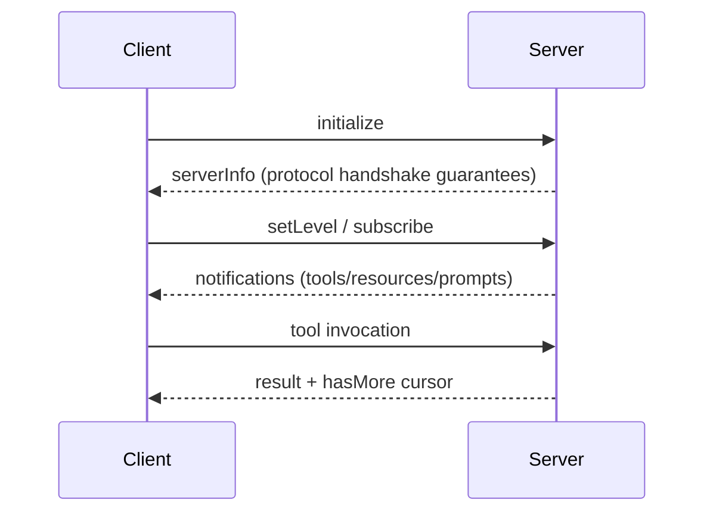
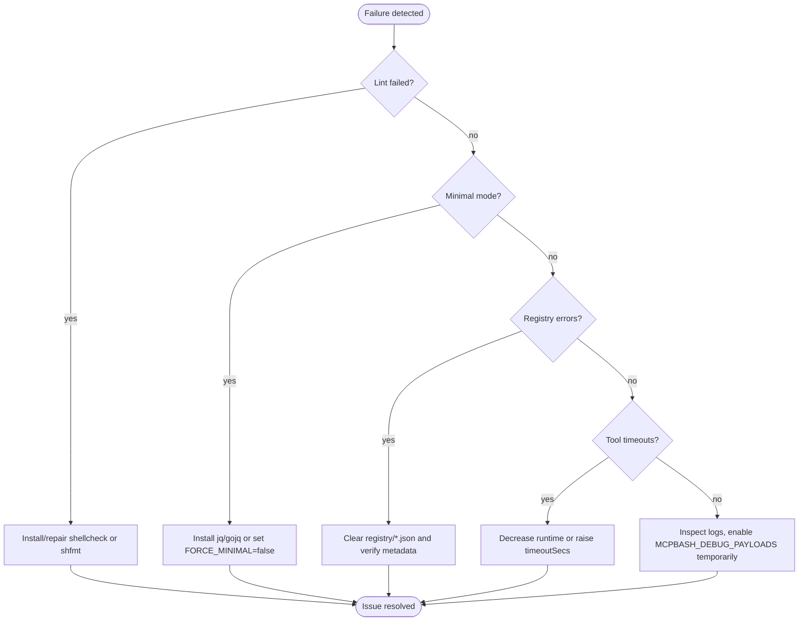

# mcp-bash Best Practices Guide

This guide distils hands-on recommendations for designing, building, and operating Model Context Protocol (MCP) servers with `mcp-bash`. It complements the normative guarantees tracked in [SPEC-COMPLIANCE.md](../SPEC-COMPLIANCE.md), the onboarding cues in [README.md](../README.md), and the workflows in [TESTING.md](../TESTING.md).

## Table of contents
- [Quick reference index](#quick-reference-index)
- [1. Introduction](#1-introduction)
- [2. Environment & tooling](#2-environment--tooling)
- [3. Project layout primer](#3-project-layout-primer)
- [4. MCP server development best practices](#4-mcp-server-development-best-practices)
- [5. Testing & quality gates](#5-testing--quality-gates)
- [6. Operational guidance](#6-operational-guidance)
- [7. Security & compliance](#7-security--compliance)
- [8. Performance & limits](#8-performance--limits)
- [9. Integration patterns](#9-integration-patterns)
- [10. Contribution workflow](#10-contribution-workflow)
- [11. Resources & further reading](#11-resources--further-reading)
- [12. Appendices](#12-appendices)
- [Doc changelog](#doc-changelog)

## Quick reference index

### Commands
| Command | Purpose | Linked section |
| --- | --- | --- |
| `bin/mcp-bash scaffold tool <name>` | Create SDK-ready tool skeleton (metadata + script) | [§4.1](#41-scaffold-workflow) |
| `bin/mcp-bash scaffold prompt <name>` | Generate prompt template + `.meta.json` | [§4.1](#41-scaffold-workflow) |
| `bin/mcp-bash scaffold resource <name>` | Produce resource boilerplate wired to the file provider | [§4.1](#41-scaffold-workflow) |
| `./test/lint.sh` | Run shellcheck + shfmt gates; wraps commands from [TESTING.md](../TESTING.md) | [§5.2](#52-local-workflow) |
| `./test/unit/lock.bats` | Validate lock/serialization primitives (`lib/lock.sh`) | [§5.1](#51-test-pyramid) |
| `./test/integration/test_capabilities.sh` | End-to-end lifecycle/capability checks | [§5.3](#53-ci-triage-matrix) |
| `./test/examples/test_examples.sh` | Smoke runner ensuring scaffolds/examples stay healthy | [§5.1](#51-test-pyramid) |
| `MCPBASH_LOG_LEVEL=debug bin/mcp-bash` | Start server with verbose diagnostics ([README.md](../README.md#diagnostics--logging)) | [§6.3](#63-monitoring-and-health) |

### Environment variables
| Variable | Description | Notes |
| --- | --- | --- |
| `MCPBASH_FORCE_MINIMAL` | Forces the minimal capability tier even when JSON tooling is available | Useful for testing degraded mode per [README.md](../README.md#runtime-detection) |
| `MCPBASH_LOG_LEVEL` / `MCPBASH_LOG_LEVEL_DEFAULT` | Sets startup log verbosity (`info` default) | Harmonises with `logging/setLevel` requests; see [§6.2](#62-logging-tracing-and-metrics) |
| `MCPBASH_DEBUG_PAYLOADS` | Persists per-message payload logs under `${TMPDIR}/mcpbash.state.*` | Enable only during targeted debugging (storage heavy) |
| `MCPBASH_MAX_CONCURRENT_REQUESTS` | Caps worker count (default 16 per [docs/LIMITS.md](LIMITS.md)) | Right-size before shipping to resource-constrained hosts |
| `MCPBASH_MAX_PROGRESS_PER_MIN` / `MCPBASH_MAX_LOGS_PER_MIN` | Throttle progress/log notifications per request | Raise with caution to avoid client overload |
| `MCP_TOOLS_TTL`, `MCP_RESOURCES_TTL`, `MCP_PROMPTS_TTL` | Control registry cache lifetime ([docs/REGISTRY.md](REGISTRY.md#ttl-and-regeneration)) | Lower values increase IO load |
| `MCP_RESOURCES_ROOTS` | Restricts file/resource providers to approved roots ([docs/SECURITY.md](SECURITY.md)) | Mandatory for multi-tenant deployments |
| `MCPBASH_REGISTRY_MAX_BYTES` | Hard stop for registry cache size | Keep aligned with operator storage policies |

### Troubleshooting keywords
- **Minimal mode** – server only exposes lifecycle/ping/logging; often triggered by missing `jq`/`gojq` or forced via `MCPBASH_FORCE_MINIMAL`.
- **Compatibility toggles** – `MCPBASH_COMPAT_BATCHES` re-enables legacy JSON-RPC batch arrays for older clients.
- **Discovery churn** – `notifications/*/list_changed` loops may indicate fast TTLs or manual registry overrides; inspect `.registry/*.json`.
- **Cancellation** – `mcp_is_cancelled` returning true mid-tool (see `examples/03-progress-and-cancellation/tools/slow.sh:5`) highlights clients timing out; revisit tool timeouts and progress cadence.
- **Progress throttling** – hitting the 100/minute default triggers warning logs and truncated progress; adjust `MCPBASH_MAX_PROGRESS_PER_MIN` when high-frequency updates matter.

## 1. Introduction
- **Protocol alignment** – Every practice references the corresponding guarantees tracked in [SPEC-COMPLIANCE.md](../SPEC-COMPLIANCE.md). Use this guide for actionable advice; use the coverage matrix to confirm parity with the protocol.
- **When to choose mcp-bash** – Prefer this implementation when Bash-only deployments, stdio transports, portable tooling, or zero-dependency sandboxes are required. Reach for other stacks when you need native gRPC transports, long-lived HTTP streaming, or language-specific runtimes.
- **Document scope** – Focuses on day-2 operations, maintainability, and collaboration across tool/prompt authors, operators, and contributors. Feature requests, product positioning, and localization are intentionally out of scope (§Out-of-Scope in the original plan).

## 2. Environment & tooling
- **Runtime prerequisites** – Bash ≥3.2, POSIX coreutils, and one JSON parser (`gojq` or `jq`) per [README.md](../README.md#runtime-detection). Confirm capability mode by piping a ping request through the server:
  ```
  printf '{"jsonrpc":"2.0","id":1,"method":"ping"}\n' | bin/mcp-bash
  ```
  A healthy install responds with `{"jsonrpc":"2.0","id":1,"result":{}}`.
- **Lint/format requirements** – Install `shellcheck` and `shfmt` before running `./test/lint.sh`. Without `shfmt`, lint fails with `Required command "shfmt" not found in PATH` (see [README.md](../README.md#developer-prerequisites)).
- **Recommended tooling bundle**:

| Tool | Check command | Notes |
| --- | --- | --- |
| `gojq` or `jq` | `jq --version` | Deterministic JSON handling unlocks full capability mode. |
| `shellcheck` | `shellcheck --version` | Required by lint. |
| `shfmt` | `shfmt --version` | Enforces consistent indentation/formatting. |
| `rg` | `rg --version` | Useful for repo-wide metadata scans. |

- **Debugging helpers** – Keep `asciinema` or screen-recording ready when capturing scaffold workflows for documentation. Add captions/alt-text for accessibility per §Supporting Assets.

## 3. Project layout primer
- **Stable vs extension directories** – Core runtime sits under `bin/`, `lib/`, `handlers/`, `providers/`, and `sdk/`. Extension-friendly directories include `tools/`, `resources/`, `prompts/`, `server.d/`, and `registry/` as illustrated in [README.md](../README.md#repository-layout).
- **Registration flows**:
  - *Auto-discovery* – Default path scanning populates `registry/*.json` (see [docs/REGISTRY.md](REGISTRY.md)). Metadata is sourced from `.meta.json` then inline `# mcp:` annotations, falling back to defaults.
  - *Manual overrides* – Place curated registrations in `server.d/register.sh` when discovery is too slow or when deterministic ordering is required (§9 of the plan). Manual files should emit valid JSON rows and respect TTL rules.
- **Environment staging** – Use `server.d/env.sh` to inject operator-specific configuration without editing tracked files. Document each variable inline for future maintainers.

## 4. MCP server development best practices

### 4.1 Scaffold workflow
1. Run `bin/mcp-bash scaffold <type> <name>` to create the initial directory structure.
2. Inspect the generated README/snippets, then layer your logic into `tools/<name>/<script>.sh` (or equivalent prompts/resources).
3. Add unit/integration coverage hitting the new artifacts (see [§5](#5-testing--quality-gates)).
4. Update docs referencing the new capability, especially if operator steps, limits, or troubleshooting expectations shift.

The scaffolder uses a per-asset directory (for example `tools/hello/hello.sh`), while some examples remain flat (for example `examples/00-hello-tool/tools/hello.sh`). Both layouts are supported by discovery; choose one and stay consistent within a project.

_Asciinema tip_: Record a short run of `bin/mcp-bash scaffold tool sample.hello` plus `./test/examples/test_examples.sh` so newcomers can view the workflow end-to-end.

### 4.2 SDK usage patterns
- **Argument parsing** – Use `mcp_args_get` with JSONPointer queries; defensively validate required fields like `examples/01-args-and-validation/tools/echo-arg.sh:5`.
- **Structured outputs** – Emit JSON via `mcp_emit_json` when returning typed data. For plain text, call `mcp_emit_text`.
- **Progress & cancellation** – Emit throttled `mcp_progress` calls (10–20 updates/request) and exit early when `mcp_is_cancelled` flips true as shown in `examples/03-progress-and-cancellation/tools/slow.sh:5`.
- **Logging** – Prefer `mcp_log_info`/`mcp_log_warn` so entries pass through the logging handler filters; avoid `echo` unless writing to stderr for fatal errors.
- **Timeouts** – Set per-tool `timeoutSecs` inside `<tool>.meta.json` when default (30 seconds) is too high/low. Align metadata with `lib/timeout.sh` expectations.

### 4.3 Error handling patterns
- Only return `-32603` (internal error) for unknown failures; otherwise map to specific JSON-RPC errors spelled out in the protocol.
- Capture stderr and propagate actionable diagnostics; see `examples/01-args-and-validation/tools/echo-arg.sh:7` for human-readable error surfaces.
- Wrap risky filesystem/network calls in helper functions so they can be retried or mocked in unit tests.

### 4.4 Logging & instrumentation
- Use `MCPBASH_LOG_LEVEL` for startup defaults, then rely on `logging/setLevel` requests for runtime tuning (§6.2).
- Enable `MCPBASH_DEBUG_PAYLOADS` only while debugging parser bugs; purge `${TMPDIR}/mcpbash.state.*` afterward to avoid leaking sensitive payloads.

### 4.5 Documentation hooks
- Every snippet in this guide and in new PRs should cite the source path/line to keep drift manageable.
- When adding diagrams, include descriptive text such as “_Mermaid sequence describing lifecycle negotiation_” so text-only readers stay informed (§Supporting Assets).

## 5. Testing & quality gates

### 5.1 Test pyramid
| Layer | Scope | Expected gates before merge |
| --- | --- | --- |
| Lint/format | `./test/lint.sh` (shellcheck+shfmt) | Always required. |
| Unit | Focused libraries (`test/unit/lock.bats`) | Required when touching `lib/*.sh` or SDK helpers. |
| Integration | Full capability smoke (`test/integration/test_capabilities.sh`) plus targeted suites (`test/integration/test_tools.sh`, etc.) | Required for handler/protocol changes. |
| Smoke/examples | `test/examples/test_examples.sh` | Run whenever scaffolded assets change. |
| Stress/soak | Custom loops combining `time ./bin/mcp-bash` with replayed JSON | Required before large releases or concurrency changes. |

### 5.2 Local workflow
1. `./test/lint.sh`
2. `./test/unit/lock.bats` (or relevant unit suite)
3. `./test/integration/test_capabilities.sh`
4. Focused suite(s) matching touched subsystem(s)
5. `./test/examples/test_examples.sh`

Cache results by exporting `MCP_TESTS_SKIP_REMOTE=1` when remote fixtures are unavailable. Document skipped suites in your PR description.

### 5.3 CI triage matrix
| Failure | Symptom | Likely fix |
| --- | --- | --- |
| `Required command "shfmt" not found` | Lint stage exits 1 immediately | Install `shfmt` or pin `GO111MODULE=on go install mvdan.cc/sh/v3/cmd/shfmt@latest`. |
| `JSON parse failure` in integration logs | CI uses minimal mode due to missing `jq/gojq` | Ensure runners have `jq` or `gojq` installed. |
| `timeoutSecs exceeded` | Tool exits via watchdog | Adjust `<tool>.meta.json` timeout, optimise logic, or move to async worker. |
| `registry cache exceeded MCPBASH_REGISTRY_MAX_BYTES` | Discovery fails after adding many assets | Increase env var for CI only or introduce manual registration. |
| Windows-specific path issues | Tests referencing `/tmp` fail | Mirror mitigations from [docs/WINDOWS.md](WINDOWS.md) (use `cygpath`, avoid `/proc`). |

## 6. Operational guidance

### 6.1 Configuration hierarchy
1. Launch-time environment variables (`MCPBASH_*`, `MCP_*`)
2. `server.d/env.sh` exports
3. Manual registration scripts overriding discovery output
4. Client-initiated negotiation (capabilities, logging)

Document configuration in `server.d/README.md` (if present) so on-call operators know which knobs are safe to adjust.

### 6.2 Logging, tracing, and metrics
- Use log levels consistent with RFC-5424 (enforced by `handlers/logging.sh`).
- Route structured diagnostics through the logging handler instead of writing raw stderr.
- When running in production, forward logs to a collector by wrapping `bin/mcp-bash` with a process supervisor that captures stdout/stderr separately.
- Consider enabling payload tracing only on reproducing hosts; sanitize archives before sharing externally.

### 6.3 Monitoring and health
- Watch `${TMPDIR}/mcpbash.state.*` for runaway payload dumps.
- Set up synthetic clients that periodically send `ping` and `logging/setLevel` to verify request handling.
- Use the following operational readiness checklist before exposing a new instance:

<a id="operational-readiness"></a>
#### Operational readiness checklist
- [ ] Ping smoke test (`printf '{"jsonrpc":"2.0","id":1,"method":"ping"}\n' | bin/mcp-bash`) returns `{"ok":true}` in full capability mode.
- [ ] `MCPBASH_MAX_CONCURRENT_REQUESTS` tuned for host CPU/memory (default 16).
- [ ] Registry TTLs set to balance discovery churn vs freshness.
- [ ] `server.d/env.sh` committed or documented for reproducibility.
- [ ] Monitoring hooks emit at least heartbeat metrics (request count, failures).
- [ ] Backups created for `registry/*.json` if manual overrides exist.
- [ ] Rollback plan (git tag, release archive, or container image) reviewed.

### 6.4 Deployment models
| Model | Description | Security notes |
| --- | --- | --- |
| Local dev | Direct `bin/mcp-bash` over stdio | Keep payload tracing off unless needed; align with developer laptops. |
| Containerised | Wrap server inside OCI image with volume mounts for `tools/`, `resources/` | Mount read-only wherever possible; use `MCP_RESOURCES_ROOTS` to limit host exposure. |
| Remote via stdio proxy | Pair with [docs/REMOTE.md](REMOTE.md) gateways to bridge HTTP/SSE | Maintain session headers, restrict outbound networking, audit proxies regularly. |

### 6.5 Discovery hygiene
- Keep `registry/` out of version control (already `.gitignore`d) and monitor growth.
- Run a nightly job that executes `bin/mcp-bash registry refresh` (future command) or a manual `rm registry/*.json` to force regeneration on schedule.
- Validate metadata via `scripts/verify-metadata.sh` (when available) before merging large batches of tools/resources.

## 7. Security & compliance
- Start with [docs/SECURITY.md](SECURITY.md) for threat model context. Apply principle of least privilege by scoping `MCP_RESOURCES_ROOTS` and sanitising environment variables inherited by tools.
- Never enable untrusted `server.d/register.sh` scripts; treat them like application code subject to review and signing.
- Secrets management: rely on OS keychains or inject short-lived tokens at launch. Avoid long-lived tokens in `.env` files that might leak through scaffolds.
- Validate third-party scaffolds before execution. Run `shellcheck` manually on contributions and require signed commits for sensitive providers.
- For compliance regimes, map MCP logs and payload dumps to your retention policies; scrub `mcpbash.state.*` directories after incidents.

## 8. Performance & limits
- Consult [docs/LIMITS.md](LIMITS.md) before tuning concurrency, payload sizes, or progress frequency.
- **Batch and pagination tuning** – When returning large lists, paginate aggressively via `lib/paginate.sh` helpers and include `hasMore` to prevent client overload.
- **Timeout strategies** – Prefer short defaults with retries over very long-running tools. If clients require streaming, add progress signals every ~5 seconds to keep the channel alive.
- **Benchmarking** – Capture `time bin/mcp-bash < sample.json` metrics before/after optimisation. When adjusting concurrency, monitor CPU steal and memory pressure to avoid thrashing.
- **Stress testing** – Re-run integration suites concurrently (e.g., `GNU parallel` around `test/integration/test_capabilities.sh`) to validate lock coordination in `lib/lock.sh`.

## 9. Integration patterns
- **Lifecycle negotiation** – Follow the message flow from the Mermaid outline below to keep clients and server aligned on protocol versions:

_Mermaid sequence describing lifecycle negotiation and capability downgrades._


- **Full vs minimal mode** – Document which commands require full JSON tooling. For example, completing resource list pagination depends on `jq` or `gojq` for canonicalisation; clients should handle `minimal` capability flags gracefully.
- **Backward compatibility** – Gate legacy JSON-RPC array batches via `MCPBASH_COMPAT_BATCHES`. Default remains strict single-object per line to keep stdout predictable.
- **Transport considerations** – When tunnelling through gateways, preserve stdio framing (one JSON object per line) and forward `Mcp-Session-Id`. Reference [docs/REMOTE.md](REMOTE.md) for gateway-specific nuances.
- **Example transcripts** – Capture happy-path sequences (initialize → tools/list → tool invocation) using `bin/mcp-bash --transcript transcripts/tool-basic.jsonl` (recording command to be added) and store sanitized transcripts under `examples/run/`.

## 10. Contribution workflow

- Follow repository coding style (2-space indent, `set -euo pipefail` headers, `shellcheck` visible directives). Use `# shellcheck disable=…` only with in-line justification (see `examples/01-args-and-validation/tools/echo-arg.sh:3`).
- Update documentation anytime you change behaviour surfaced in [README.md](../README.md), [SPEC-COMPLIANCE.md](../SPEC-COMPLIANCE.md), or this guide.
- Keep commits focused; each should include docs/tests when touching behaviour.
- Release cadence suggestion: tag monthly and document release notes referencing limits, operational changes, and compatibility toggles.

<a id="pre-merge-checklist"></a>
#### Pre-merge checklist
- [ ] `./test/lint.sh` + required unit/integration suites pass locally.
- [ ] Added/updated tools have `.meta.json` with accurate descriptions, arguments, and `timeoutSecs`.
- [ ] Docs updated (README, coverage matrix, this guide) when behaviour or limits shift.
- [ ] Added snippets cite source path/line.
- [ ] Accessibility review performed for diagrams/media (alt text, captions).
- [ ] SECURITY/LIMITS implications reviewed and documented if applicable.

<a id="reviewer-checklist"></a>
#### Reviewer checklist
- [ ] Verify capability negotiation remains correct (no regressions in `handlers/lifecycle.sh`).
- [ ] Confirm tests illustrate new edge cases (unit + integration as applicable).
- [ ] Check metadata/registry changes for deterministic ordering and size limits.
- [ ] Ensure operator docs mention new configuration/environment toggles.
- [ ] Validate security boundaries (no unchecked user input reaching shell).

#### Evergreen best-practice template
1. Capture the scenario/problem (one paragraph).
2. Cite relevant protocol areas and repo paths.
3. Provide runnable snippet referencing `path:line`.
4. List verification steps/tests.
5. Update cross-links (README/coverage/test docs) and changelog entry below.

## 11. Resources & further reading
- [README.md](../README.md) – Overall scope, runtime guarantees, scaffolding summary.
- [SPEC-COMPLIANCE.md](../SPEC-COMPLIANCE.md) – Protocol parity checklist.
- [TESTING.md](../TESTING.md) – Command references for lint/unit/integration suites.
- [docs/SECURITY.md](SECURITY.md) – Threat model + least-privilege defaults.
- [docs/LIMITS.md](LIMITS.md) – Performance guardrails.
- [docs/REMOTE.md](REMOTE.md) – Guidance for HTTP/SSE gateways.
- MCP community resources (Discord, issue tracker) – Ask about roadmap or interoperability quirks; link PRs referencing this guide when requesting feedback.

## 12. Appendices

### FAQ
- **Why does minimal mode trigger unexpectedly?** – Double-check that `jq` or `gojq` is on `PATH`. When absent, the server falls back to minimal mode, which limits features.
- **How do I keep registry scans fast?** – Limit directory depth, set TTL to ≥5 seconds, and avoid generating thousands of entries per type; consider manual registration for static sets.
- **Can I embed binary resources?** – Prefer referencing files via resource providers; if binary data is required, base64-encode it within a resource response and document size implications per [docs/LIMITS.md](LIMITS.md).

### Glossary
- **Capability mode** – Either `full` (JSON tooling available) or `minimal` (reduced handler surface).
- **Discovery** – Automated scanning of `tools/`, `resources/`, `prompts/` resulting in cached registries.
- **TTL** – Time-to-live controlling how long registries remain cached before rescans.
- **Worker slot** – Concurrent request execution slot bounded by `MCPBASH_MAX_CONCURRENT_REQUESTS`.

### Quick command reference
```
# Lint & format
./test/lint.sh

# Run unit tests
./test/unit/lock.bats

# Run integration suite
./test/integration/test_capabilities.sh

# Smoke examples
./test/examples/test_examples.sh
```

### Troubleshooting tree
_Mermaid decision tree describing common failure triage paths._


## Doc changelog
| Date | Version | Notes |
| --- | --- | --- |
| 2025-10-18 | v1.0 | Initial publication covering development, testing, operations, and contribution guidance. |
